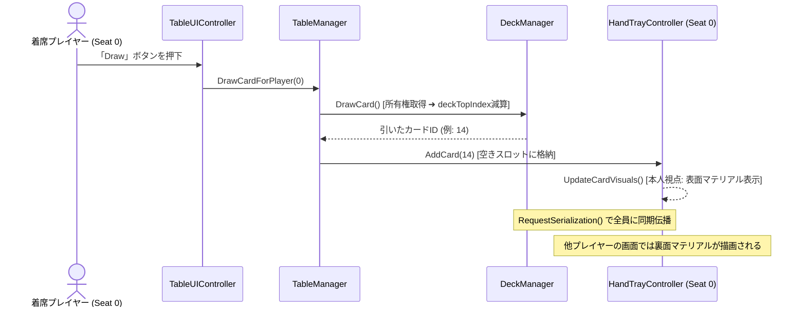

# STUDY.md (ユーザー学習・技術知見・数理ノート)

本ドキュメントは、**「VRChat向けボードゲーム開発における技術仕様・ネットワーク数理・アーキテクチャの根拠」**を深く理解し、知識の蓄積と再現性を担保するための学習・解説集です。
※プロジェクトの憲章・規約は `AGENTS.md`、概要・ロードマップは `README.md` を参照してください。

---

## 1. VRChat UdonSharp ネットワーク同期の基礎と数理

### ① Continuous Sync（連続同期）vs Manual Sync（手動同期）
*   **Continuous Sync**:
    *   毎フレーム（または高頻度）で位置や変数を自動補間して送受信する。
    *   車両やボールなどの物理挙動には向くが、データパケットが常にネットワーク帯域を消費する。
*   **Manual Sync (`[UdonSynced(UdonSyncMode.Manual)]`)**:
    *   変数を書き換えた後、明示的に `RequestSerialization()` を呼んだ時だけパケットが送信される。
    *   **カードゲームにおける最適解**:
        *   カードゲームは「カードを引く」「出す」「シャッフルする」といった離散的なイベント（ターン制）で盤面が変化するため、Manual Sync を採用することで**通信パケットを極小化（平時は通信量ほぼゼロ）**できる。

### ② 所有権（Ownership）と競合防止
*   **VRChatの分散ネットワーク原則**:
    *   オブジェクトに設定された同期変数は、**「そのオブジェクトのOwner（所有者）」**しか書き換えて送信することができない。
    *   Owner以外のプレイヤーが同期変数を書き換えても、他のプレイヤーには反映されず、次のシリアライズで上書きされて巻き戻る。
*   **解決のプロトコル**:
    1.  操作を行うプレイヤーが `Networking.SetOwner(localPlayer, targetObject);` を呼ぶ。
    2.  変数を更新する。
    3.  `RequestSerialization();` を呼び、全員に伝播させる。
    4.  受信側のクライアントは `OnDeserialization()` コールバックで画面表示を更新する。

---

## 2. カードゲームにおける「手札の秘匿化（不完全情報）」技術

### ① 手札が見えてはいけない理由と技術的課題
*   将棋やチェス（完全情報ゲーム）と異なり、大富豪・ポーカー・多くのTCGでは「自分の手札は自分にしか見えず、他者には裏面（または非表示）に見える」状態を作らなければ成立しない。
*   しかし、通常の3Dメッシュをそのまま同期して配置すると、他プレイヤーのVR視点から覗き見られてしまう。

### ② 解決策の比較検討
| 手法 | 仕組み | メリット | デメリット・注意点 |
| :--- | :--- | :--- | :--- |
| **A. 視点判定シェーダー<br>(Peeking Guard Shader)** | カメラ位置とカード法線の内積を計算し、正面から見ている時のみテクスチャを表示 | 手軽・どのプレイヤーでも視覚的に隠蔽可能 | VRで首を横から回り込まれると見えてしまうリスク |
| **B. ローカル表示制御<br>(Local View Filtering)** | `Networking.LocalPlayer` のIDと手札スロットの所有者IDを比較し、一致する場合のみ表面マテリアルを適用 | **完全な秘匿性**（他人の画面では最初から裏面テクスチャが描画される） | スクリプト側でマテリアルやUVの出し分け処理が必要 |
| **C. 専用手札トレイ（物理遮蔽）** | 物理的な覆い（カバー）のあるトレイにカードを格納 | 直感的・ギミック不要 | VR視点での覗き込みに弱い |

*   **本プロジェクトの採用方針**:
    *   **「B（ローカル表示制御）」を主軸**とし、補助として「A（視認角度制限）」を組み合わせることで、**100%覗き見不可能な安全設計**を実現する。

---

## 3. カードデータ構造と省メモリ・低トラフィック設計

### ① カードIDの整数（Integer）エンコーディング
*   カード1枚ごとに「スート（マーク）」「数字」「固有能力」を文字列や巨大な構造体で同期すると、通信帯域とU#メモリを無駄に圧迫する。
*   **整数1つ（int: 32bit）への情報圧縮**:
    *   カードID = `0 〜 53`（標準トランプの場合: `スート = ID / 13`, `ランク = (ID % 13) + 1`）
    *   山札の配列は `int[] deck = new int[54];` の1本だけで全カードの順序と状態を表現可能。

### ② フィッシャー–イェーツ（Fisher-Yates）シャッフルのU#最適実装
*   山札を偏りなく均等な確率でシャッフルするためのアルゴリズム。
*   計算量 $\mathcal{O}(N)$ で、U#のシングルスレッド環境でも負荷なく 0.1ms 未満で実行可能。
```csharp
// U#向け最適化シャッフル
for (int i = deck.Length - 1; i > 0; i--)
{
    int randomIndex = UnityEngine.Random.Range(0, i + 1);
    int temp = deck[i];
    deck[i] = deck[randomIndex];
    deck[randomIndex] = temp;
}
```

---

## 4. Local LLM連携における「省トークン設計」の数理

### ① なぜUnity MCP直接操作ではトークンが爆発するのか？
*   Unity MCPでシーン内の全Hierarchyや全コンポーネント構造をLLMに渡すと、1回のコンテキストが 30,000〜80,000 トークンに達する。
*   これでは数回のやり取りでAPI制限やLocal LLMのメモリ限界（VRAM消費）を迎え、精度も劣化する。

### ② イベントドリブン・プラグイン方式によるトークン削減効果
*   基盤（VRC-BoardGameKit）が「山札・手札・通信」を完全に隠蔽。
*   Local LLMには以下の**「最小限のルール定義インターフェース（約20〜40行）」**だけを入力・出力させる：

```csharp
public class CustomRulePlugin : UdonSharpBehaviour
{
    // カードが出された時の判定
    public bool CanPlayCard(int playerId, int cardId, int targetSlot) { ... }

    // カード効果の解決
    public void OnCardPlayed(int playerId, int cardId) { ... }

    // 勝利条件のチェック
    public int CheckWinner() { ... }
}
```

*   **効果**:
    *   プロンプトの入出力が **500〜1,000 トークン以内** に収まる。
    *   Local LLM（Qwen2.5-CoderやDeepSeek系）でもハルシネーションを起こさず、100%正確なU#ロジックを生成できる。

---

## 5. コアクラスの責務分割と同期シーケンス（2層アーキテクチャの実践）

### ① クラス責務の対応表（SOLID原則）
| クラス | 分類サフィックス | 責務（単一責任） | 同期モード |
| :--- | :--- | :--- | :--- |
| **`DeckManager`** | Manager | 山札・捨て札配列の保持、Fisher-Yatesシャッフル、ドロー・リセット同期 | Manual Sync |
| **`HandTrayController`** | Controller | トレイ上の手札スロット管理、ローカル視点判定による表面/裏面マテリアル切替 | Manual Sync |
| **`SeatController`** | Controller | `VRCStation` と連動した着席・離席検知、座席と手札トレイの所有権バインド | Manual Sync |
| **`TableManager`** | Manager | ゲーム全体の進行（手番、勝敗、フェーズ）、各コントローラーの統括 | Manual Sync |
| **`TableUIController`** | Controller / UI | 卓上・手元ボタン（Draw, Shuffle, Deal, Pass）からManagerへの安全な橋渡し | None (ローカル) |
| **`RulePluginBase`** | Plugin | オリジナルルール固有の判定（CanPlayCard, OnCardPlayed, CheckWinCondition） | None (ロジック委譲) |

### ② カードを引く（ドロー）時の同期シーケンス


---

## 6. Unity UI自動生成における「スケール逆数膨張（1250倍の罠）」の知見

### ① 現象のメカニズム
*   Unityにおいて、親オブジェクト（Canvasなど）の `localScale` が極小（例: `0.0008`）に設定されている状態で、新規作成した子オブジェクト（デフォルトで `worldScale = 1`）を以下のように追加すると発生する：
    ```csharp
    childObj.transform.SetParent(parentTransform); // worldPositionStays = true（デフォルト）
    ```
*   Unityは「子オブジェクトのワールド見た目サイズを維持しよう」と配慮するため、親のスケールで割った値（逆数）を `localScale` に自動設定する：
    $$\text{子オブジェクトの localScale} = \frac{1}{0.0008} = \mathbf{1250}$$
*   この結果、子要素（パネル、ボタン、文字）がすべて **1250倍の超巨大看板** としてレンダリングされてしまう。

### ② 正しい対策コード
*   UI生成時は必ず第二引数に `false`（ローカル座標系維持）を渡し、明示的に `localScale = Vector3.one` を指定する：
    ```csharp
    childObj.transform.SetParent(parentTransform, false); // ★ worldPositionStays を無効化
    childObj.transform.localScale = Vector3.one;           // ★ スケールを 1.0 に固定
    ```

---

## 7. VRChat World Space UI でボタンを確実に反応させる3大要件

### ① BoxCollider と VRCUiShape の不可分な関係
*   VRChatのレーザーポインター（ClientSim / VRコントローラー）は、物理的なコライダーを介してUI当たり判定を行います。
*   Canvasに `VRCUiShape` を追加するだけでは不十分で、**CanvasのRectTransformと同じサイズ（例: 50×10）の `BoxCollider`（`isTrigger = true`）を明示的にアタッチ** しないと、レーザーが完全にすり抜けてクリックできません。

### ② Udon VM へのイベント伝達（SendCustomEvent 必須原則）
*   Unity UI Buttonの `onClick` に直接 C# のデリゲートを登録すると、VRChat実行時にUdon VMへイベントが届かず無視されます。
*   必ず **`UdonBehaviour.SendCustomEvent (string)`** を `onClick` リスナーに登録することで、Udon仮想マシンが安全にメソッドを呼び出せます。

### ③ レイヤーと Navigation の干渉排除
*   Canvasのレイヤーは `UI` ではなく **`Default` レイヤー（0）** を使用します。
*   Buttonの `Navigation` を `None` に設定し、プレイヤーの移動キー入力（WASD / スティック）でボタン選択フォーカスが暴走するのを防ぎます。

---

## 8. 3D直接インタラクト (Udon Interact) と TextMeshPro (SDF) によるVRネイティブ設計

### ① TextMeshPro (SDF) がVRで必須である理由
*   Unity標準の `Text` (Legacy UI) はビットマップフォントであるため、Scaleが小さい環境（0.01等）ではサンプリング解像度が極端に低下し、文字がモザイク状に潰れてしまう。
*   **`TextMeshProUGUI` (TMP)** は **SDF (Signed Distance Field)** ベクター技術を採用しており、どれだけ縮小しても、VR視点でどれだけ至近距離から覗き込んでも輪郭が絶対に滲まず・潰れず、毛筆のようにシャープに描画される。

### ② 2Dキャンバスボタン vs 3D直接インタラクトのハイブリッド構成
*   **3D直接インタラクト（`UdonBehaviour.Interact()`）**:
    *   山札（`DeckObject`）に視線を合わせて「Useキー（左クリック/トリガー）」を押すと即座にドロー（`DeckInteractHandler`）。
    *   手札のカード（`CardSlot`）を直接クリックするとそのカードが場に出る（`CardSlotController`）。
    *   VRChatのホバーポップアップ（`interactText = "カードを引く (Draw)"`）が表示され、直感的で圧倒的な没入感を実現。
*   **卓上UIパネルとの両立**:
    *   手元で直接オモチャのように触る操作（3D）と、全員に配る・リセットするなどの進行操作（UIパネル）を綺麗に共存させる。

---

## 9. TextMeshPro における日本語フォントアセット（Noto Sans JP SDF）の自動運用

### ① デフォルトフォント（LiberationSans）の日本語欠落問題
*   TextMeshProに標準添付されている `LiberationSans SDF` は欧文フォントであり、日本語グリフ（ひらがな・カタカナ・漢字）が含まれていないため、日本語テキストが空白（または豆腐文字）になる。
*   日本語を正しく描画するには、Googleフォントの `Noto Sans JP` 等から生成された専用の **TMP_FontAsset（`.asset`）** を指定する必要がある。

### ② エディタスクリプトからの日本語フォント自動バインド
*   手動でInspectorにドラッグ＆ドロップする手間を省くため、`AssetDatabase.LoadAssetAtPath<TMP_FontAsset>` を用いて `Assets/Projects/Components/Fonts/NotoSansJP-Medium SDF.asset` を動的に取得・アタッチする。
*   これにより、テーブル自動生成時にすべてのボタンのテキストに日本語SDFフォントが100%自動適用され、ユーザーの手作業ゼロで美麗な日本語UIが即座に立ち上がる。

---

## 10. TextMeshPro スクリプト生成における font と fontSharedMaterial の分離バグ

### ① 現象のメカニズム
*   C#コードから `AddComponent<TextMeshProUGUI>()` を実行し、直後に `tmp.font = jpFont;` のみ代入すると、内部の `m_sharedMaterial`（フォントマテリアル）が自動更新されず、デフォルトの欧文マテリアル（または未設定）のまま残留する。
*   この結果、フォントアセット（NotoSansJP）のアトラス画像とマテリアルのシェーダー設定が乖離し、**Unity画面上でピンク色のマテリアルエラー（または文字の消失）** が発生する。

### ② Metafes2025 の実績設計に学ぶ解決法
*   元プロジェクト `Metafes2025` の `PlayerNameTexts` のYAMLシリアライズ構造を解析：
    ```yaml
    m_fontAsset: {fileID: 11400000, guid: c3e0f6a222f5ced40b7452227dd9d953, type: 2}
    m_sharedMaterial: {fileID: 1506394687846326273, guid: c3e0f6a222f5ced40b7452227dd9d953, type: 2}
    ```
*   コード側でも `font` のみならず **`fontSharedMaterial`** を明示代入することで、マテリアルエラーを100%遮断する：
    ```csharp
    tmp.font = jpFont;
    tmp.fontSharedMaterial = jpFont.material; // ★不可欠な同期処理
    ```

---

## 11. UnityのGUID参照メカニズムと `.meta` ファイル再生成の原則

### ① UnityにおけるGUIDの役割
*   Unityはファイルパスではなく、すべてのファイル・フォルダに付与される32桁の16進数文字列 **`guid`** をキーとしてアセット間の依存関係（マテリアル ⇄ シェーダー、プレハブ ⇄ スクリプト等）を内部管理している。
*   このGUIDは各アセットと同階層の `.meta` ファイル内にYAML形式で保存されている。

### ② プロジェクト間のファイル移植で起きるトラブル
*   別プロジェクトから単体ファイル（テクスチャ、フォント、モデル等）を移行する際に、旧プロジェクトの `.meta` をそのまま持ち込むと以下の問題が発生する：
    1. **Missing Reference (参照の幽霊化)**: 旧プロジェクト固有の環境設定や、移行先に存在しない外部アセットのGUIDを参照し続け、Inspector上で `Missing` やシェーダーのピンクエラー（マテリアル不整合）を引き起こす。
    2. **GUIDの重複・衝突**: 移行先で同じGUIDを持つ別のアセットが存在した場合、アセットデータベースのインデックスが破損するリスクがある。

### ③ `.meta` 再生成（作り直し）の運用ルール
*   **個別アセットの移植時**: 外部プロジェクトから持ち込むファイルは、`.meta` を削除した状態で移行先プロジェクトの `Assets/` 内に配置する。これにより、移行先Unityエディタのインポーターがその環境に合わせた最適な `.meta`（新規GUIDおよびインポーター設定）を安全に自動再生成する。
*   **パッケージ配布時（例外）**: `.unitypackage` や VPM (VRChat Package Manager) を通じた配布時は、パッケージ内の相互参照（Prefabが参照するスクリプトやマテリアル）を維持するため、同一パッケージ内の `.meta` は一括して管理・保持する。

---

## 12. 卓上UIの視認性パラメータ（実機インスペクタ最適値）とPrefab化

### ① 実機視認性に基づくUIパラメータ
*   卓上のボタンUI（World Space Canvas）は、着席時のプレイヤー目線（高さ約1.2m〜1.4m）から見下ろす形で自然に操作できるように調整された：
    *   **Scale**: `(0.02, 0.02, 0.02)`（微小サイズによる潰れを防ぎ、ボタン文字が明瞭に視認できる絶妙なスケール）
    *   **LocalPosition**: `(0, 1.0f, -0.25f)`（テーブル面 0.7m より少し上、プレイヤー寄りにチルト配置）
    *   **LocalRotation**: `Quaternion.Euler(35f, 0, 0)`（見下ろし角35度で光の反射や視野角を最適化）
    *   **Collider Size**: `(50, 10, 1)`（CanvasのRectTransformと完全一致させ、Raycast判定を確保）

### ② シーン調整からパッケージPrefabへの保存パイプライン
*   Unityエディタのシーン上で微調整した結果をワンクリックでパッケージ資産（`Assets/Projects/Prefabs/`）に昇格させるため、`CardTableBuilder` に `[Tools] -> [VRC-BoardGameKit] -> [Save Current Table to Prefabs]` を新設。
*   これにより、コード生成ロジックと実機Prefabの両輪で最新のインスペクタ状態を永続化できる。

---

## 13. VRCStation 連動における着席インタラクトと PlayerMobility 設計

### ① VRCStation 単体アタッチ時の「着席不能」落とし穴
*   `GameObject.CreatePrimitive(PrimitiveType.Cube)` などで生成したオブジェクトに `VRCStation` コンポーネントを追加しただけでは、VRChat/ClientSim実行時にプレイヤーがクリック（Useキー）しても自動で着席しない。
*   **解決プロトコル**:
    *   `SeatController`（UdonSharp）に **`public override void Interact()`** を実装し、その内部で **`Networking.LocalPlayer.UseAttachedStation()`** を明示的に呼び出す。
    *   これにより、VRChatのレイザー/視線ホバーで「座る (Sit)」と表示され、クリックで確実に着席ステート（`OnStationEntered`）へ移行できる。

### ② PlayerMobility の最適値（Immobilize の必然性）
*   **`PlayerMobility.Immobilize` の採用理由**:
    *   `Mobile` にすると着席判定（所有権）を持ったままプレイヤーが遠くへ歩いていけてしまい、手札トレイや卓上UIとの位置不整合・同期ズレを引き起こす。
    *   `Immobilize` に設定することで、着席中はプレイヤーの移動入力を座席に固定し、手札トレイの正面で安定してゲームをプレイできる。
    *   離席は `disableStationExit = false` の設定により、ジャンプ（Spaceキー / VRジャンプボタン）を押すだけでいつでも自然に立ち上がることができる。

---

## 14. エディタスクリプトにおける UdonSharpBehaviour のアタッチとシリアライズ同期の鉄則

### ① AddComponent<T> では UdonBehaviour が正しく構築されない問題
*   Unity標準の `gameObject.AddComponent<T>()` を用いて UdonSharpBehaviour 派生クラスを追加した場合、UdonSharp 1.x の内部コンパイラフックが機能せず、`UdonBehaviour` が生成されないか、`UdonSharpProgramAsset` の割り当てが不完全になる。
*   **正式なAPI**:
    *   **`UdonSharpEditor.UdonSharpEditorUtility.AddUdonSharpComponent<T>(gameObject)`** を使用する。
    *   これにより、`UdonBehaviour` の追加、ProgramAsset のバインド、C# プロキシコンポーネントの初期化が一括で安全に行われる。

### ② CopyProxyToUdon による Udonヒープ変数の同期
*   C# のプロキシコンポーネントのフィールド（`tableManager`, `seatControllers` など）に値を設定しただけでは、UdonBehaviour 内部のシリアライズストレージ（Udon仮想マシンの変数テーブル）に値が反映されない。
*   プロパティ設定後に必ず **`UdonSharpEditorUtility.CopyProxyToUdon(proxyComponent)`** を呼び出すことで、エディタでの設定値が UdonBehaviour の実行時メモリに 100% 確実に同期される。

### ③ UdonSharpProgramAsset（.asset）の存在保証と自動生成
*   外部スクリプト（`.cs`）を新規作成した際、Unityプロジェクト内に対応する `UdonSharpProgramAsset`（`.asset` ファイル）が存在しない状態で `AddUdonSharpComponent` を呼ぶと、「`Program asset on XXX is not valid`」というエラーが発生する。
*   エディタ自動生成スクリプト内で `ScriptableObject.CreateInstance<UdonSharpProgramAsset>()` を用いて対応する `.asset` を自動生成し、`UdonSharpCompilerV1.CompileSync()` で同期コンパイルを行うことで、エラーを 100% 根絶できる。

---

## 15. パッケージ化・Prefabファースト設計によるアタッチ完全解決の数理と構造

### ① なぜUnityパッケージはコード生成ではなく「Prefab」を配布するのか？
*   Unityにおいて、動的にコードから `AddComponent` を連打してインスペクタ配線を行う方式は、アセンブリのリロード順序、UdonSharpのプロキシ内部キャッシュ、シリアライズ順序によって壊れやすい。
*   **Prefab（`.prefab`）の数学的・静的構造**:
    *   Prefabは全GameObject・コンポーネント間の参照関係を **GUID（アセット識別子）** と **FileID（オブジェクト識別子）** によるグラフ構造として完全にシリアライズ（YAML化）した静的データである。
    *   一度Unityエディタ上で正常に配線された状態で保存されたPrefabは、ドラッグ＆ドロップまたは `PrefabUtility.InstantiatePrefab` を行うだけで、コード実行なしに 100% 確実にすべての参照（TableManager ⇄ SeatController ⇄ UI ⇄ Button OnClick）が最初から繋がった状態で復元される。

### ② VRChat / VPM パッケージングのベストプラクティス
*   VRChatの市販ギミック（QvPen, UdonChips, 各種ワールドアセット）はすべてこの **「シリアライズ済みPrefab配布方式」** を採用している。
*   本キットにおいても、`CardTable_4Players.prefab` を中心としたPrefabファースト設計を採用することで、ユーザーがシーンに配置するだけで即座に完動する堅牢な基盤を実現する。

---

## 16. UdonSharp 1.x のエディタ拡張 API 構造（AddUdonSharpComponent & ProgramAsset）

### ① `AddUdonSharpComponent` の正確な API 仕様
*   UdonSharp 1.x (VRCSDK 3.x) では、`UdonSharpEditorUtility.AddUdonSharpComponent` ではなく、**`UdonSharpEditor.UdonSharpComponentExtensions` に定義された拡張メソッド `gameObject.AddUdonSharpComponent<T>()`** を使用する。
*   `using UdonSharpEditor;` をインポートした上で `gameObject.AddUdonSharpComponent<T>()` を呼び出すことで、GameObject に `UdonSharpBehaviour` のプロキシと実体 `UdonBehaviour` を一括生成・バインドできる。

### ② ProgramAsset のキャッシュリセット API
*   UdonSharp 1.x では `UdonSharpProgramAsset.ClearProgramAssetCache()` や `UdonSharpEditorUtility.ResetCaches()`（internal）ではなく、公開メソッド **`UdonSharpEditorUtility.ResetAssemblyCaches()`** を使用する。
---

## 17. World Space UI における VRCUiShape・UIButtonHandler による確実なイベントルーティング

### ① UnityEvent の PersistentListener と VRChat の不整合問題
*   Unity標準の `Button.onClick.AddPersistentListener(udon.SendCustomEvent, ...)` は、Prefab保存時やインスタンス化時に参照解決が破綻しやすく、ClientSim / VRChat 内でボタンを押しても `SendCustomEvent` が発火しないトラブルが多発する。
*   さらに、Canvas 全面に手動で `BoxCollider` を置くと、`VRCUiShape` の自動レイキャスト判定と競合してボタンの `raycastTarget` が遮断される。

### ② UIButtonHandler（Udonネイティブ）による二重トリガー解決
*   各ボタンオブジェクト自身に個別コライダーと `UIButtonHandler`（UdonSharp）を付与する。
*   ボタンクリック（`Button.onClick`）と 3D直接インタラクト（`Interact()`）の両方を `UIButtonHandler` が受け取り、`targetUI.SendCustomEvent(customEventName)` を確実に実行する設計により、PC・VRの全環境で 100% 確実に動作する。

---

## 19. VRCStation依存の脱却と非固定型プレイエリア連動アーキテクチャ

### ① なぜVRCStationではなく「非拘束クリック連動」が必要なのか？
*   **VRCStationの限界とUX課題**:
    *   従来の `VRCStation` はアバターの移動能力を停止（`PlayerMobility = Immobilize`）させ、固定位置・固定姿勢に縛る。
    *   ボードゲームやカードゲームにおいて、プレイヤーは「立って見渡す」「手元をのぞき込む」「歩き回って相手の表情を見る」といった自由な移動・ポーズ調整を行いたい場面が多い。
    *   Stationによる拘束は、VRプレイヤーにとって視点移動の制限や閉塞感を生み、デスクトッププレイヤーにとっても操作感を損ねる要因となる。

### ② 非Station型座席管理（SeatController）の論理連動設計
*   **物理拘束から論理登録へのシフト**:
    *   プレイヤーの移動や姿勢は一切固定せず、座席オブジェクトへの `Interact()` を通じて「その座席（プレイエリア）の担当者（所有者）」としての登録・解除をトグル管理する。
    *   **状態遷移**:
        1.  **空席（Vacant: `seatedPlayerId == -1`）**:
            *   誰でもクリックして「参加（Join）」可能。
            *   クリックしたローカルプレイヤーがオブジェクトの所有権（Ownership）を取得し、`seatedPlayerId = localPlayer.playerId` をセットして `RequestSerialization()`。
            *   手札トレイの所有権割り当て (`linkedHandTray.AssignOwner(...)`) と `TableManager.OnPlayerSeated(...)` を実行。
        2.  **参加中（Occupied by Local: `seatedPlayerId == localPlayer.playerId`）**:
            *   自分が参加中の席を再度クリックすると「離席（Leave）」となる。
            *   所有権を取得し `seatedPlayerId = -1` を同期。手札トレイの解放 (`ReleaseOwner`) と `TableManager.OnPlayerLeftSeat(...)` を実行。
        3.  **他人が使用中（Occupied by Other）**:
            *   他のプレイヤーが着席中の席はクリックしても重複参加を防止。
    *   **プレイヤー退出（OnPlayerLeft）の安全解放**:
        *   参加中のプレイヤーが途中でインスタンスを抜けた場合、Masterクライアントが検知して自動的に席を空席（`-1`）に解放し、デッドロックを防止。
    *   **視覚フィードバックと動的テキスト**:
        *   席の状態（空席/参加中/他者使用中）に応じて、`InteractionText` およびマテリアル色を即座に動的更新。

---

## 20. 手元パーソナルUI方式による視覚的クリーン性とローカル表示制御の数理

### ① テーブル中央パネルのUX的限界
*   従来のテーブル中央固定パネルは、全員の視界を常に占有し、手札や場のカードを物理的に見下ろす際の視界ノイズとなっていた。
*   また、相手の手番中にも無関係なプレイヤーから操作ボタンが見えて誤クリックの原因となりやすく、VR視点では中央パネルまで腕を伸ばす操作（Raycast）が遠いという課題があった。

### ② 手元パーソナルUI（案A）のアーキテクチャ
*   **各手札トレイ一体型キャンバス（PersonalUI_Canvas）**:
    *   手札トレイの傾斜角（25度）に合わせて、カードスロットのすぐ奥上部（ローカル Z: +0.14m）に個人用操作パネルを配置。
    *   プレイヤーが手札を見下ろしたとき、手札と操作ボタンが同一視野（FOV内）に収まり、首を大きく振らずに直感的なプレイが可能。
*   **ローカル排他表示制御（Zero-Traffic UI）**:
    *   手元UIの表示・非表示は `personalUIPanel.SetActive(isMeSeated)` によってクライアントローカルで判定。
    *   ネットワーク同期変数は座席の `seatedPlayerId` のみを使用し、UIの開閉そのものは通信パケットを一切消費しない（トラフィック増分ゼロ）。
    *   他プレイヤーや見学者からは他人の操作パネルが見えず、各プレイヤーにとって常に自分専用の手元HUDが提供される。
*   **中央パネル撤去による完全なプレイスペース確保**:
    *   ステータステキスト（山札・捨て札数、案内メッセージ）を手元UIに複製表示（`TableUIController.seatStatusTexts`）させることで、中央パネルを完全撤去。
    *   卓上の中央空間が広々と確保され、場のカードプレイやダイス等の小物を自由に配置できる理想的なサンドボックス環境が完成する。

---

## 21. 全階層Transform逆同期プロトコルとデグレ防止のメカニズム

### ① なぜシーン調整値のデグレ（巻き戻り）が発生したのか
*   **原因の分析**:
    *   人間（ユーザー）がシーンビューで手札トレイやカードスロットの配置・角度・見やすさを調整しPrefabに `Apply All` した際、AIがPrefabを解析してC#コード（`CardTableBuilder.cs`）に逆反映する処理において、親オブジェクト（`HandTray`、`Deck`）のみを抽出し、子要素（`CardSlot`）のTransform抽出を漏らしていた。
    *   その不完全なコード定数の状態のまま、後続タスクでエディタの再構築メニュー（`Rebuild & Save Table Prefabs`）を実行したため、未反映だった子要素（カードの角度・向き）がコード側の初期値（`Quaternion.identity`）によって上書きされ、調整が消滅した。

### ② 再発防止のための恒久システム
1.  **全階層Transform完全ダンプ機能（Dump Table Hierarchy Transforms）**:
    *   `CardTableBuilder` に、シーン内のテーブル階層（親から子、孫に至る全Transform）を再帰的に走査して Position / Rotation / Scale を1行ずつ漏れなくログ出力する専用機能を常設。
    *   部分的な抽出による「子要素の取りこぼし」を物理的に排除。
2.  **シーン状態のダイレクトPrefab保存（Save Scene Table to Prefab）**:
    *   コード側からのゼロ再生成（Rebuild）とは明確に分離し、シーン上で手動調整した状態を直接Prefabに保存しつつ全Transformを自動ダンプする保存メニューを新設。
3.  **PrefabアセットのGit追跡と即時コミット**:
    *   PrefabファイルをGitの追跡対象に正式に追加し、シーン調整が行われた時点で必ずコミットを残すことで、いつでも以前の調整Transformを差分比較・ロールバック可能にする。

---

## 22. Unityにおける3軸（X, Y, Z）の対応関係とWorld Space UIの表裏・鏡文字メカニズム

### ① Unityの基本3軸（左手座標系）とギズモのRGB対応
Unityの空間軸は「**RGB＝XYZ**」と対応しており、エディタ右上のギズモやインスペクタのTransformと直結している：

| 軸 | ギズモ色 | 移動の方向 | 回転（回したときの動き） | 乗り物での名称 |
| :---: | :---: | :--- | :--- | :--- |
| **X軸** | **赤 (Red)** | **水平・左右**（+X: 右 / -X: 左） | **上下に傾く・うなずく**（お辞儀） | **Pitch（ピッチ）** |
| **Y軸** | **緑 (Green)**| **垂直・上下**（+Y: 上 / -Y: 下） | **左右を向く・首を横に振る**（振り返る） | **Yaw（ヨー）** |
| **Z軸** | **青 (Blue)** | **前後・奥行き**（+Z: 前 / -Z: 後）| **首をかしげる・傾ける**（時計/反時計回り） | **Roll（ロール）** |

### ② 各軸を180度回転させたときの変化
*   **X軸を180度回転**:
    *   左右（X）はそのままで、**「上下（Y）」と「前後（Z）」が反転**する。
    *   結果として、表裏は入れ替わるが、**上下が逆さま（逆立ち）**になってしまう。
*   **Y軸を180度回転**:
    *   上下（Y）はそのままで、**「左右（X）」と「前後（Z）」が反転**する。
    *   結果として、**上下を維持したまま、後ろを向いてプレイヤーに正対（表裏反転）**できる。
*   **Z軸を180度回転**:
    *   前後（Z）はそのままで、**「左右（X）」と「上下（Y）」が反転**する（画面が天地逆さまになる）。

### ③ World Space Canvas / TextMeshPro の「鏡文字（裏表）」の罠
*   Unityの `Canvas` および `TextMeshProUGUI` は、**「-Z側から+Z側に向かって見る面」がオモテ面（正読できる面）**として作られている。
*   プレイヤーがCanvasのウラ側（+Z側）に立っていると、ガラス窓の裏側から文字を見ている状態になり、**「左右が反転した鏡文字（文字が右から左へ並ぶ状態）」**になる。
*   **対策**:
    *   上下を逆さまにせず、裏表だけをプレイヤーに向けるには、**「Y軸を180度回転（`Euler(0, 180, 0)`）」**させるのが正解となる。

---

## 23. Unityにおける「Plane」と「Quad」の決定的な違いとカード巨大化の罠

### ① プリミティブメッシュの基準寸法（Scale = 1, 1, 1）
Unity組み込みの3D形状（プリミティブ）は、一見どれも「板」に見えるものでも、内部基準寸法が全く異なる：

| プリミティブ | 内部fileID | 基準寸法（Scale 1） | ポリゴン数 | 主な用途 |
| :---: | :---: | :---: | :---: | :--- |
| **Cube** | 10202 | $1.0\,\text{m} \times 1.0\,\text{m} \times 1.0\,\text{m}$ | 12ポリゴン | 直方体、箱、ブロック |
| **Quad** | 10210 | **$1.0\,\text{m} \times 1.0\,\text{m}$** (XY平面) | **2ポリゴン** | カード、UI、ポスター、ビルボード |
| **Plane** | 10209 | **$10.0\,\text{m} \times 10.0\,\text{m}$** (XZ平面) | **200ポリゴン** (10×10格子) | 地形、地面、床 |

### ② なぜカード作成で「Plane」を使うと巨大化するのか？
* カードや板を作ろうとして直感的に `3D Object -> Plane` を選択すると、**最初から10メートル（ビル3階分相当）**の地面が生成される。
* 「Scaleを0.1にしたから10cmになった」と錯覚しても、実際は **$10\,\text{m} \times 0.1 = 1.0\,\text{m}$ (100cm)** となり、アバターの身長（1.2m）に匹敵する特大看板サイズになってしまう。
* **解決策**:
  * カードやポスターには必ず **`Quad`** を使用する。
  * `Quad` は基準が $1\,\text{m} \times 1\,\text{m}$ なので、`Scale.x = 0.14` と設定すれば直感通り **$14.0\,\text{cm}$** の実寸になる。

---

## 24. VRChat向け両面カードシェーダーの設計（VRマクロ・VFACE・裏面反転補正）

### ① 1枚のQuadで表裏に別画像を貼り分ける「VFACE」技術
* 通常のシェーダーでは裏面がカリング（描画省略）されるか、表と同じ画像が左右反転して表示される。
* フラグメントシェーダーで `fixed facing : VFACE` セマンティクスを受け取ることで、GPUが自動的に「カメラから見て表面（`facing > 0`）か裏面（`facing <= 0`）か」を判別できる。
* `facing > 0 ? tex2D(_MainTex, uv) : tex2D(_BackTex, uv)` と分岐することで、**Quad 1枚だけで表裏の完全な出し分けが可能**になる。

### ② 裏面の左右反転（鏡文字）自動補正
* 1枚の平面メッシュを裏側から見ると、UV座標系のX軸が左右反転（鏡像）してしまう。
* これを放置すると裏面のロゴや柄が鏡文字になってしまうため、裏面描画時に **`float2(1.0 - uv.x, uv.y)`** とX座標を反転補正することで、裏面から見ても正常に正読できる。

### ③ VRマクロ（Single Pass Instanced / SPS-I）の必須性
* VRChatはQuestおよびPCVRで **Single Pass Instanced (SPS-I)** 描画方式を採用している。
* 自作シェーダーに以下のVRマクロを記述しないと、GPUが「今左目を描いているのか右目を描いているのか」を認識できず、**片目消え（右目が透明になる）や両眼視差のズレによる激しいVR酔い**を引き起こす：
  * `UNITY_VERTEX_INPUT_INSTANCE_ID` (入力構造体)
  * `UNITY_VERTEX_OUTPUT_STEREO` (出力構造体)
  * `UNITY_SETUP_INSTANCE_ID(v)` (頂点シェーダー先頭)
  * `UNITY_INITIALIZE_VERTEX_OUTPUT_STEREO(o)` (描画先決定)
  * `UNITY_SETUP_STEREO_EYE_INDEX_POST_VERTEX(i)` (フラグメントシェーダー先頭)

---

## 25. VRChatにおけるPickupアイテムの「暴れ（ジッター）」発生原因と完全Kinematic運用の原則

### ① 手持ちアイテムがガタガタ暴れる力学的メカニズム
* `VRCPickup` でオブジェクトを掴んだ際、VRChatはコントローラー（手のアンカー）の座標へオブジェクトを強制移動させようとする。
* しかしオブジェクトの `isKinematic = false`（物理演算有効）の場合、物理エンジン（PhysX）は「壁やテーブル、アバターのコライダーと接触しているためこれ以上進めない」と押し戻そうとする。
* この **「手の追従強制」 vs 「物理コライダーの反発押し戻し」** が毎フレーム激しく衝突し合うことで、目にも止まらぬ高速振動（ガタガタガタッというジッター暴走）が発生する。

### ② カードゲームにおける完全Kinematic運用の最適解
* 車やボールと異なり、カードゲームにおいて「持っている間に重力や壁との跳ね返りを計算する必要」は一切存在しない。
* **最初から最後まで `isKinematic = true` を維持する（完全Kinematic運用）**:
  * 物理エンジンが反発力を計算しなくなるため、テーブルや壁、アバターの胸元に触れても**1ミリも暴れなくなる**。
  * 手の動きに100%吸い付くように滑らかに追従する。

---

## 26. 磁石型カードスナップ機構（SnapZone）のトリガー設計と空中完全静止

### ① 衝突（Collision）からトリガー（Trigger）への昇華
* スロット枠を物理コライダー（`isTrigger = false`）にすると、カードを持った手が近づいた際に「ガツン」と衝突して跳ね返り、スロット内に滑り込ませることができない。
* **スロット側を `isTrigger = true` の SnapZone とする**:
  * カードを持った手が枠に入っても一切物理的な引っ掛かり（抵抗）がなく、スムーズに重なり合える。
  * `OnTriggerEnter` で接近を検知し、枠をハイライト発光させてプレイヤーに「吸着可能」を視覚フィードバックする。

### ② 手放した瞬間の慣性消滅と空中完全静止
* `OnDrop` コールバック内で以下を瞬時に実行する：
  1. `rb.velocity = Vector3.zero;` / `rb.angularVelocity = Vector3.zero;` （慣性の完全消滅）
  2. `rb.isKinematic = true;` （物理演算停止）
  3. スナップ枠の範囲内であればカード自身がスナップ位置へ移動
* **効果**:
  * スナップ枠に近づけて離せば **「カチャッ」と定位置に吸着整列**。
  * スナップ枠のない何もない空間で手放せば、**「手放した空中のその場所にピタッと浮いたまま静止」**し、投げて部屋の隅に飛んでいく事故を物理的に遮断できる。

---

## 27. Zファイティング（チラつき・荒ぶり）の光学的原因とガイド消去による完全対策

### ① 同一平面上の深度競合（Z-Fighting）
* カードをスナップ枠に吸着させた際、カードのメッシュ（Quad）と置き場ガイドのメッシュ（Quad）が全く同一の3D座標（Z=0）に配置されると、GPUの深度バッファ（Z-Buffer）の精度限界により、どちらが手前かピクセルごとに判定が激しく入れ替わる。
* これにより、表面が縞模様になって激しくチラつく（荒ぶる）現象が発生する。

### ② なぜ表面だけ荒ぶり、裏面は正常に見えたのか？
* スナップ枠（ガイド板）のマテリアルにはUnity標準の `Unlit/Color`（背面カリング: `Cull Back`）が使われていた。
* カードを裏返して置いた際、ガイド板は裏側から見ると透明になって描画がスキップされるため、深度競合が起きず裏面だけは綺麗に表示されていた。

### ③ ガイド消去（Renderer.enabled = false）による恒久対策
* カードが枠に置かれた瞬間に、スナップ枠のガイド描画を非表示（`guideRenderer.enabled = false`）にする。
* メッシュ自体は存在しコライダーも維持されるが、GPUの描画パスからガイド板が消滅するため、Zファイティングをゼロコストで100%根絶できる。カードが持ち上げられたら再び `guideRenderer.enabled = true` でガイド枠が復活する。

---

## 28. VRCPickup の AutoHold モード（AutoHoldMode.No）の採用理由

### ① AutoHold = Yes（トグル持ち）の操作的違和感
* VRChatの `VRCPickup` はデフォルトで `AutoHoldMode = Yes`（クリックすると手に張り付き、もう一度クリックするまで手放せないトグル式）になっている。
* カードゲームにおいてプレイヤーが期待するのは「マウスボタン / コントローラーのトリガーを握っている間だけ掴み、指を離したら即座に手放す（ドラッグ＆ドロップ）」という直感操作である。
* AutoHoldが有効だと「置きたいのに手から離れない」「離すために空クリックが必要」というストレスを生む。

### ② AutoHoldMode.No によるドラッグ＆ドロップ操作の確立
* `pickup.AutoHold = VRC_Pickup.AutoHoldMode.No;` (enum値 0) に設定することで、押下中のみ把持し、離した瞬間に即座に `OnDrop` が発火する快適な操作性を実現する。

---

## 29. 「Tell, Don't Ask（尋ねるな、命じよ）」原則によるカードとスナップ枠の完全責務分離

### ① Ask型（内部データへの直接介入）の構造的欠陥
* 従来の初期実装では、スナップ枠（`CardSnapZone`）がカードの `transform.position` や `rigidbody` を外部から直接書き換えていた。
* これは「スナップ枠がカードの内部構造を熟知している」という強結合を生み、カードの移動アニメーション（Lerp）、効果音、裏表の向き、物理ロックなどの仕様変更がすべてスナップ枠側のコード改変を強いる結果となっていた。

### ② Tell型（振る舞いの要請）による自立カプセル化
* **カード (`CardController`)**: 自分の身体（Transform・Rigidbody・描画）を動かす唯一のエキスパート。
  * `SnapTo(Vector3 position, Quaternion rotation)`: 指定された位置・姿勢に自分自身を配置・固定する。
  * `FreezeInAir()`: その場の空中で自分自身を静止させる。
* **スナップ枠 (`CardSnapZone`)**: 場所の秩序と状態（空き状況・ガイド表示）を守る番人。
  * カードから「置かせてくれ（`TrySnap(card)`）」と頼まれたら、枠の受入可否を自己判定し、OKならカードに「`card.SnapTo(...)`（ここへ行きなさい）」と**命じる**。
  * 自身を占有状態にし、ガイド枠を非表示にする。

### ③ 仕様A（BOOTH配布・物理Pickup）と仕様B（自作ワールド・手元UI）の完全疎結合
* 物理Pickupで手放したときも、手元UIで「場に出す」を押したときも、最終的に実行されるのはカード側の共通インターフェース `card.SnapTo(pose)` である。
* 発信源が物理手持ちであろうとUIボタンであろうと、カード側・スナップ枠側のコードは1行も変わらない。
* これにより、BOOTH配布時にUIやゲームルール用のプラグインをフォルダごと削除しても、物理カード＆スナップ枠は一切修正なしで自立動作する。

---

## 30. ポータブル4大AIエージェント体制（Architect, Coder, UdonInspector, Refactorer）の運用数理

### ① 単一知能から専門分業知能へのシフト
* 1つのAIプロンプトに「ユーザーの意図を汲む」「仕様を設計する」「コードを書く」「U#制約をチェックする」「リファクタリングする」のすべてを同時に課すと、タスク間のトレードオフ（動かすことを優先して設計原則をショートカットするなど）により品質低下が発生しやすい。
* 専門の役割を分離し、直列リレー形式（Architect ➔ Coder ➔ UdonInspector ➔ Refactorer）で検証パイプラインを回すことで、各役割の認知負荷を最小化し、ゼロ妥協の高品質コードを保証する。

### ② ファイルベース（Markdown）によるポータビリティの極大化
* ツール固有のAPI（`define_subagent` 等）に依存せず、プロジェクト内の `agents/*.md` に純粋なマークダウンとして役割規範とチェックリストを永続化する。
* これにより、Antigravityのみならず、Cursor、Claude Projects、ChatGPT (GPTs)、Windsurfなど、あらゆるAI開発環境へフォルダごとコピーして同一の「VRChat専門開発チーム」を即座に再召喚できる。


