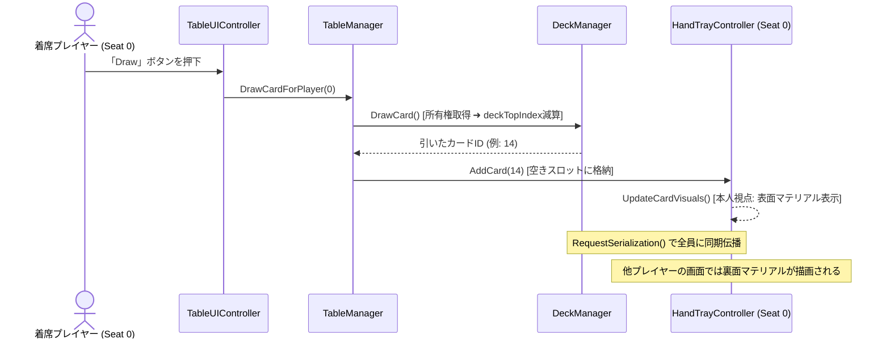

# STUDY.md (ユーザー学習・技術知見・数理ノート)

本ドキュメントは、**「VRChat向けボードゲーム開発における技術仕様・ネットワーク数理・アーキテクチャの根拠」**を深く理解し、知識の蓄積と再現性を担保するための学習・解説集です。
※プロジェクトの憲章・規約は `AGENTS.md`、概要・ロードマップは `README.md` を参照してください。

---

## 1. VRChat UdonSharp ネットワーク同期の基礎と数理

### ① Continuous Sync（連続同期）vs Manual Sync（手動同期）
*   **Continuous Sync**:
    *   毎フレーム（または高頻度）で位置や変数を自動補間して送受信する。
    *   車両やボールなどの物理挙動には向くが、データパケットが常にネットワーク帯域を消費する。
*   **Manual Sync (`[UdonSynced(UdonSyncMode.Manual)]`)**:
    *   変数を書き換えた後、明示的に `RequestSerialization()` を呼んだ時だけパケットが送信される。
    *   **カードゲームにおける最適解**:
        *   カードゲームは「カードを引く」「出す」「シャッフルする」といった離散的なイベント（ターン制）で盤面が変化するため、Manual Sync を採用することで**通信パケットを極小化（平時は通信量ほぼゼロ）**できる。

### ② 所有権（Ownership）と競合防止
*   **VRChatの分散ネットワーク原則**:
    *   オブジェクトに設定された同期変数は、**「そのオブジェクトのOwner（所有者）」**しか書き換えて送信することができない。
    *   Owner以外のプレイヤーが同期変数を書き換えても、他のプレイヤーには反映されず、次のシリアライズで上書きされて巻き戻る。
*   **解決のプロトコル**:
    1.  操作を行うプレイヤーが `Networking.SetOwner(localPlayer, targetObject);` を呼ぶ。
    2.  変数を更新する。
    3.  `RequestSerialization();` を呼び、全員に伝播させる。
    4.  受信側のクライアントは `OnDeserialization()` コールバックで画面表示を更新する。

---

## 2. カードゲームにおける「手札の秘匿化（不完全情報）」技術

### ① 手札が見えてはいけない理由と技術的課題
*   将棋やチェス（完全情報ゲーム）と異なり、大富豪・ポーカー・多くのTCGでは「自分の手札は自分にしか見えず、他者には裏面（または非表示）に見える」状態を作らなければ成立しない。
*   しかし、通常の3Dメッシュをそのまま同期して配置すると、他プレイヤーのVR視点から覗き見られてしまう。

### ② 解決策の比較検討
| 手法 | 仕組み | メリット | デメリット・注意点 |
| :--- | :--- | :--- | :--- |
| **A. 視点判定シェーダー<br>(Peeking Guard Shader)** | カメラ位置とカード法線の内積を計算し、正面から見ている時のみテクスチャを表示 | 手軽・どのプレイヤーでも視覚的に隠蔽可能 | VRで首を横から回り込まれると見えてしまうリスク |
| **B. ローカル表示制御<br>(Local View Filtering)** | `Networking.LocalPlayer` のIDと手札スロットの所有者IDを比較し、一致する場合のみ表面マテリアルを適用 | **完全な秘匿性**（他人の画面では最初から裏面テクスチャが描画される） | スクリプト側でマテリアルやUVの出し分け処理が必要 |
| **C. 専用手札トレイ（物理遮蔽）** | 物理的な覆い（カバー）のあるトレイにカードを格納 | 直感的・ギミック不要 | VR視点での覗き込みに弱い |

*   **本プロジェクトの採用方針**:
    *   **「B（ローカル表示制御）」を主軸**とし、補助として「A（視認角度制限）」を組み合わせることで、**100%覗き見不可能な安全設計**を実現する。

---

## 3. カードデータ構造と省メモリ・低トラフィック設計

### ① カードIDの整数（Integer）エンコーディング
*   カード1枚ごとに「スート（マーク）」「数字」「固有能力」を文字列や巨大な構造体で同期すると、通信帯域とU#メモリを無駄に圧迫する。
*   **整数1つ（int: 32bit）への情報圧縮**:
    *   カードID = `0 〜 53`（標準トランプの場合: `スート = ID / 13`, `ランク = (ID % 13) + 1`）
    *   山札の配列は `int[] deck = new int[54];` の1本だけで全カードの順序と状態を表現可能。

### ② フィッシャー–イェーツ（Fisher-Yates）シャッフルのU#最適実装
*   山札を偏りなく均等な確率でシャッフルするためのアルゴリズム。
*   計算量 $\mathcal{O}(N)$ で、U#のシングルスレッド環境でも負荷なく 0.1ms 未満で実行可能。
```csharp
// U#向け最適化シャッフル
for (int i = deck.Length - 1; i > 0; i--)
{
    int randomIndex = UnityEngine.Random.Range(0, i + 1);
    int temp = deck[i];
    deck[i] = deck[randomIndex];
    deck[randomIndex] = temp;
}
```

---

## 4. Local LLM連携における「省トークン設計」の数理

### ① なぜUnity MCP直接操作ではトークンが爆発するのか？
*   Unity MCPでシーン内の全Hierarchyや全コンポーネント構造をLLMに渡すと、1回のコンテキストが 30,000〜80,000 トークンに達する。
*   これでは数回のやり取りでAPI制限やLocal LLMのメモリ限界（VRAM消費）を迎え、精度も劣化する。

### ② イベントドリブン・プラグイン方式によるトークン削減効果
*   基盤（VRC-BoardGameKit）が「山札・手札・通信」を完全に隠蔽。
*   Local LLMには以下の**「最小限のルール定義インターフェース（約20〜40行）」**だけを入力・出力させる：

```csharp
public class CustomRulePlugin : UdonSharpBehaviour
{
    // カードが出された時の判定
    public bool CanPlayCard(int playerId, int cardId, int targetSlot) { ... }

    // カード効果の解決
    public void OnCardPlayed(int playerId, int cardId) { ... }

    // 勝利条件のチェック
    public int CheckWinner() { ... }
}
```

*   **効果**:
    *   プロンプトの入出力が **500〜1,000 トークン以内** に収まる。
    *   Local LLM（Qwen2.5-CoderやDeepSeek系）でもハルシネーションを起こさず、100%正確なU#ロジックを生成できる。

---

## 5. コアクラスの責務分割と同期シーケンス（2層アーキテクチャの実践）

### ① クラス責務の対応表（SOLID原則）
| クラス | 分類サフィックス | 責務（単一責任） | 同期モード |
| :--- | :--- | :--- | :--- |
| **`DeckManager`** | Manager | 山札・捨て札配列の保持、Fisher-Yatesシャッフル、ドロー・リセット同期 | Manual Sync |
| **`HandTrayController`** | Controller | トレイ上の手札スロット管理、ローカル視点判定による表面/裏面マテリアル切替 | Manual Sync |
| **`SeatController`** | Controller | `VRCStation` と連動した着席・離席検知、座席と手札トレイの所有権バインド | Manual Sync |
| **`TableManager`** | Manager | ゲーム全体の進行（手番、勝敗、フェーズ）、各コントローラーの統括 | Manual Sync |
| **`TableUIController`** | Controller / UI | 卓上・手元ボタン（Draw, Shuffle, Deal, Pass）からManagerへの安全な橋渡し | None (ローカル) |
| **`RulePluginBase`** | Plugin | オリジナルルール固有の判定（CanPlayCard, OnCardPlayed, CheckWinCondition） | None (ロジック委譲) |

### ② カードを引く（ドロー）時の同期シーケンス


---

## 6. Unity UI自動生成における「スケール逆数膨張（1250倍の罠）」の知見

### ① 現象のメカニズム
*   Unityにおいて、親オブジェクト（Canvasなど）の `localScale` が極小（例: `0.0008`）に設定されている状態で、新規作成した子オブジェクト（デフォルトで `worldScale = 1`）を以下のように追加すると発生する：
    ```csharp
    childObj.transform.SetParent(parentTransform); // worldPositionStays = true（デフォルト）
    ```
*   Unityは「子オブジェクトのワールド見た目サイズを維持しよう」と配慮するため、親のスケールで割った値（逆数）を `localScale` に自動設定する：
    $$\text{子オブジェクトの localScale} = \frac{1}{0.0008} = \mathbf{1250}$$
*   この結果、子要素（パネル、ボタン、文字）がすべて **1250倍の超巨大看板** としてレンダリングされてしまう。

### ② 正しい対策コード
*   UI生成時は必ず第二引数に `false`（ローカル座標系維持）を渡し、明示的に `localScale = Vector3.one` を指定する：
    ```csharp
    childObj.transform.SetParent(parentTransform, false); // ★ worldPositionStays を無効化
    childObj.transform.localScale = Vector3.one;           // ★ スケールを 1.0 に固定
    ```


