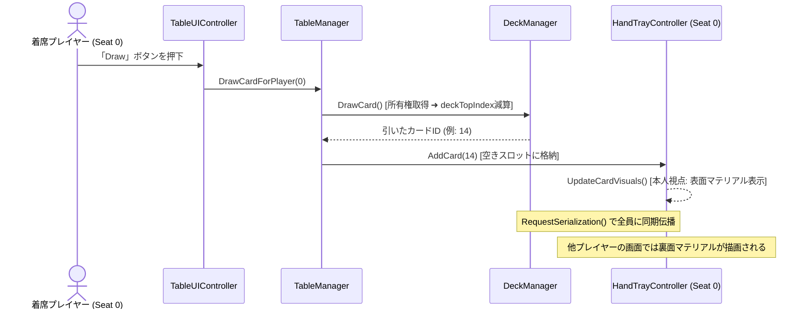

# STUDY.md (ユーザー学習・技術知見・数理ノート)

本ドキュメントは、**「VRChat向けボードゲーム開発における技術仕様・ネットワーク数理・アーキテクチャの根拠」**を深く理解し、知識の蓄積と再現性を担保するための学習・解説集です。
※プロジェクトの憲章・規約は `AGENTS.md`、概要・ロードマップは `README.md` を参照してください。

---

## 1. VRChat UdonSharp ネットワーク同期の基礎と数理

### ① Continuous Sync（連続同期）vs Manual Sync（手動同期）
*   **Continuous Sync**:
    *   毎フレーム（または高頻度）で位置や変数を自動補間して送受信する。
    *   車両やボールなどの物理挙動には向くが、データパケットが常にネットワーク帯域を消費する。
*   **Manual Sync (`[UdonSynced(UdonSyncMode.Manual)]`)**:
    *   変数を書き換えた後、明示的に `RequestSerialization()` を呼んだ時だけパケットが送信される。
    *   **カードゲームにおける最適解**:
        *   カードゲームは「カードを引く」「出す」「シャッフルする」といった離散的なイベント（ターン制）で盤面が変化するため、Manual Sync を採用することで**通信パケットを極小化（平時は通信量ほぼゼロ）**できる。

### ② 所有権（Ownership）と競合防止
*   **VRChatの分散ネットワーク原則**:
    *   オブジェクトに設定された同期変数は、**「そのオブジェクトのOwner（所有者）」**しか書き換えて送信することができない。
    *   Owner以外のプレイヤーが同期変数を書き換えても、他のプレイヤーには反映されず、次のシリアライズで上書きされて巻き戻る。
*   **解決のプロトコル**:
    1.  操作を行うプレイヤーが `Networking.SetOwner(localPlayer, targetObject);` を呼ぶ。
    2.  変数を更新する。
    3.  `RequestSerialization();` を呼び、全員に伝播させる。
    4.  受信側のクライアントは `OnDeserialization()` コールバックで画面表示を更新する。

---

## 2. カードゲームにおける「手札の秘匿化（不完全情報）」技術

### ① 手札が見えてはいけない理由と技術的課題
*   将棋やチェス（完全情報ゲーム）と異なり、大富豪・ポーカー・多くのTCGでは「自分の手札は自分にしか見えず、他者には裏面（または非表示）に見える」状態を作らなければ成立しない。
*   しかし、通常の3Dメッシュをそのまま同期して配置すると、他プレイヤーのVR視点から覗き見られてしまう。

### ② 解決策の比較検討
| 手法 | 仕組み | メリット | デメリット・注意点 |
| :--- | :--- | :--- | :--- |
| **A. 視点判定シェーダー<br>(Peeking Guard Shader)** | カメラ位置とカード法線の内積を計算し、正面から見ている時のみテクスチャを表示 | 手軽・どのプレイヤーでも視覚的に隠蔽可能 | VRで首を横から回り込まれると見えてしまうリスク |
| **B. ローカル表示制御<br>(Local View Filtering)** | `Networking.LocalPlayer` のIDと手札スロットの所有者IDを比較し、一致する場合のみ表面マテリアルを適用 | **完全な秘匿性**（他人の画面では最初から裏面テクスチャが描画される） | スクリプト側でマテリアルやUVの出し分け処理が必要 |
| **C. 専用手札トレイ（物理遮蔽）** | 物理的な覆い（カバー）のあるトレイにカードを格納 | 直感的・ギミック不要 | VR視点での覗き込みに弱い |

*   **本プロジェクトの採用方針**:
    *   **「B（ローカル表示制御）」を主軸**とし、補助として「A（視認角度制限）」を組み合わせることで、**100%覗き見不可能な安全設計**を実現する。

---

## 3. カードデータ構造と省メモリ・低トラフィック設計

### ① カードIDの整数（Integer）エンコーディング
*   カード1枚ごとに「スート（マーク）」「数字」「固有能力」を文字列や巨大な構造体で同期すると、通信帯域とU#メモリを無駄に圧迫する。
*   **整数1つ（int: 32bit）への情報圧縮**:
    *   カードID = `0 〜 53`（標準トランプの場合: `スート = ID / 13`, `ランク = (ID % 13) + 1`）
    *   山札の配列は `int[] deck = new int[54];` の1本だけで全カードの順序と状態を表現可能。

### ② フィッシャー–イェーツ（Fisher-Yates）シャッフルのU#最適実装
*   山札を偏りなく均等な確率でシャッフルするためのアルゴリズム。
*   計算量 $\mathcal{O}(N)$ で、U#のシングルスレッド環境でも負荷なく 0.1ms 未満で実行可能。
```csharp
// U#向け最適化シャッフル
for (int i = deck.Length - 1; i > 0; i--)
{
    int randomIndex = UnityEngine.Random.Range(0, i + 1);
    int temp = deck[i];
    deck[i] = deck[randomIndex];
    deck[randomIndex] = temp;
}
```

---

## 4. Local LLM連携における「省トークン設計」の数理

### ① なぜUnity MCP直接操作ではトークンが爆発するのか？
*   Unity MCPでシーン内の全Hierarchyや全コンポーネント構造をLLMに渡すと、1回のコンテキストが 30,000〜80,000 トークンに達する。
*   これでは数回のやり取りでAPI制限やLocal LLMのメモリ限界（VRAM消費）を迎え、精度も劣化する。

### ② イベントドリブン・プラグイン方式によるトークン削減効果
*   基盤（VRC-BoardGameKit）が「山札・手札・通信」を完全に隠蔽。
*   Local LLMには以下の**「最小限のルール定義インターフェース（約20〜40行）」**だけを入力・出力させる：

```csharp
public class CustomRulePlugin : UdonSharpBehaviour
{
    // カードが出された時の判定
    public bool CanPlayCard(int playerId, int cardId, int targetSlot) { ... }

    // カード効果の解決
    public void OnCardPlayed(int playerId, int cardId) { ... }

    // 勝利条件のチェック
    public int CheckWinner() { ... }
}
```

*   **効果**:
    *   プロンプトの入出力が **500〜1,000 トークン以内** に収まる。
    *   Local LLM（Qwen2.5-CoderやDeepSeek系）でもハルシネーションを起こさず、100%正確なU#ロジックを生成できる。

---

## 5. コアクラスの責務分割と同期シーケンス（2層アーキテクチャの実践）

### ① クラス責務の対応表（SOLID原則）
| クラス | 分類サフィックス | 責務（単一責任） | 同期モード |
| :--- | :--- | :--- | :--- |
| **`DeckManager`** | Manager | 山札・捨て札配列の保持、Fisher-Yatesシャッフル、ドロー・リセット同期 | Manual Sync |
| **`HandTrayController`** | Controller | トレイ上の手札スロット管理、ローカル視点判定による表面/裏面マテリアル切替 | Manual Sync |
| **`SeatController`** | Controller | `VRCStation` と連動した着席・離席検知、座席と手札トレイの所有権バインド | Manual Sync |
| **`TableManager`** | Manager | ゲーム全体の進行（手番、勝敗、フェーズ）、各コントローラーの統括 | Manual Sync |
| **`TableUIController`** | Controller / UI | 卓上・手元ボタン（Draw, Shuffle, Deal, Pass）からManagerへの安全な橋渡し | None (ローカル) |
| **`RulePluginBase`** | Plugin | オリジナルルール固有の判定（CanPlayCard, OnCardPlayed, CheckWinCondition） | None (ロジック委譲) |

### ② カードを引く（ドロー）時の同期シーケンス


---

## 6. Unity UI自動生成における「スケール逆数膨張（1250倍の罠）」の知見

### ① 現象のメカニズム
*   Unityにおいて、親オブジェクト（Canvasなど）の `localScale` が極小（例: `0.0008`）に設定されている状態で、新規作成した子オブジェクト（デフォルトで `worldScale = 1`）を以下のように追加すると発生する：
    ```csharp
    childObj.transform.SetParent(parentTransform); // worldPositionStays = true（デフォルト）
    ```
*   Unityは「子オブジェクトのワールド見た目サイズを維持しよう」と配慮するため、親のスケールで割った値（逆数）を `localScale` に自動設定する：
    $$\text{子オブジェクトの localScale} = \frac{1}{0.0008} = \mathbf{1250}$$
*   この結果、子要素（パネル、ボタン、文字）がすべて **1250倍の超巨大看板** としてレンダリングされてしまう。

### ② 正しい対策コード
*   UI生成時は必ず第二引数に `false`（ローカル座標系維持）を渡し、明示的に `localScale = Vector3.one` を指定する：
    ```csharp
    childObj.transform.SetParent(parentTransform, false); // ★ worldPositionStays を無効化
    childObj.transform.localScale = Vector3.one;           // ★ スケールを 1.0 に固定
    ```

---

## 7. VRChat World Space UI でボタンを確実に反応させる3大要件

### ① BoxCollider と VRCUiShape の不可分な関係
*   VRChatのレーザーポインター（ClientSim / VRコントローラー）は、物理的なコライダーを介してUI当たり判定を行います。
*   Canvasに `VRCUiShape` を追加するだけでは不十分で、**CanvasのRectTransformと同じサイズ（例: 50×10）の `BoxCollider`（`isTrigger = true`）を明示的にアタッチ** しないと、レーザーが完全にすり抜けてクリックできません。

### ② Udon VM へのイベント伝達（SendCustomEvent 必須原則）
*   Unity UI Buttonの `onClick` に直接 C# のデリゲートを登録すると、VRChat実行時にUdon VMへイベントが届かず無視されます。
*   必ず **`UdonBehaviour.SendCustomEvent (string)`** を `onClick` リスナーに登録することで、Udon仮想マシンが安全にメソッドを呼び出せます。

### ③ レイヤーと Navigation の干渉排除
*   Canvasのレイヤーは `UI` ではなく **`Default` レイヤー（0）** を使用します。
*   Buttonの `Navigation` を `None` に設定し、プレイヤーの移動キー入力（WASD / スティック）でボタン選択フォーカスが暴走するのを防ぎます。

---

## 8. 3D直接インタラクト (Udon Interact) と TextMeshPro (SDF) によるVRネイティブ設計

### ① TextMeshPro (SDF) がVRで必須である理由
*   Unity標準の `Text` (Legacy UI) はビットマップフォントであるため、Scaleが小さい環境（0.01等）ではサンプリング解像度が極端に低下し、文字がモザイク状に潰れてしまう。
*   **`TextMeshProUGUI` (TMP)** は **SDF (Signed Distance Field)** ベクター技術を採用しており、どれだけ縮小しても、VR視点でどれだけ至近距離から覗き込んでも輪郭が絶対に滲まず・潰れず、毛筆のようにシャープに描画される。

### ② 2Dキャンバスボタン vs 3D直接インタラクトのハイブリッド構成
*   **3D直接インタラクト（`UdonBehaviour.Interact()`）**:
    *   山札（`DeckObject`）に視線を合わせて「Useキー（左クリック/トリガー）」を押すと即座にドロー（`DeckInteractHandler`）。
    *   手札のカード（`CardSlot`）を直接クリックするとそのカードが場に出る（`CardSlotController`）。
    *   VRChatのホバーポップアップ（`interactText = "カードを引く (Draw)"`）が表示され、直感的で圧倒的な没入感を実現。
*   **卓上UIパネルとの両立**:
    *   手元で直接オモチャのように触る操作（3D）と、全員に配る・リセットするなどの進行操作（UIパネル）を綺麗に共存させる。

---

## 9. TextMeshPro における日本語フォントアセット（Noto Sans JP SDF）の自動運用

### ① デフォルトフォント（LiberationSans）の日本語欠落問題
*   TextMeshProに標準添付されている `LiberationSans SDF` は欧文フォントであり、日本語グリフ（ひらがな・カタカナ・漢字）が含まれていないため、日本語テキストが空白（または豆腐文字）になる。
*   日本語を正しく描画するには、Googleフォントの `Noto Sans JP` 等から生成された専用の **TMP_FontAsset（`.asset`）** を指定する必要がある。

### ② エディタスクリプトからの日本語フォント自動バインド
*   手動でInspectorにドラッグ＆ドロップする手間を省くため、`AssetDatabase.LoadAssetAtPath<TMP_FontAsset>` を用いて `Assets/Projects/Components/Fonts/NotoSansJP-Medium SDF.asset` を動的に取得・アタッチする。
*   これにより、テーブル自動生成時にすべてのボタンのテキストに日本語SDFフォントが100%自動適用され、ユーザーの手作業ゼロで美麗な日本語UIが即座に立ち上がる。

---

## 10. TextMeshPro スクリプト生成における font と fontSharedMaterial の分離バグ

### ① 現象のメカニズム
*   C#コードから `AddComponent<TextMeshProUGUI>()` を実行し、直後に `tmp.font = jpFont;` のみ代入すると、内部の `m_sharedMaterial`（フォントマテリアル）が自動更新されず、デフォルトの欧文マテリアル（または未設定）のまま残留する。
*   この結果、フォントアセット（NotoSansJP）のアトラス画像とマテリアルのシェーダー設定が乖離し、**Unity画面上でピンク色のマテリアルエラー（または文字の消失）** が発生する。

### ② Metafes2025 の実績設計に学ぶ解決法
*   元プロジェクト `Metafes2025` の `PlayerNameTexts` のYAMLシリアライズ構造を解析：
    ```yaml
    m_fontAsset: {fileID: 11400000, guid: c3e0f6a222f5ced40b7452227dd9d953, type: 2}
    m_sharedMaterial: {fileID: 1506394687846326273, guid: c3e0f6a222f5ced40b7452227dd9d953, type: 2}
    ```
*   コード側でも `font` のみならず **`fontSharedMaterial`** を明示代入することで、マテリアルエラーを100%遮断する：
    ```csharp
    tmp.font = jpFont;
    tmp.fontSharedMaterial = jpFont.material; // ★不可欠な同期処理
    ```

---

## 11. UnityのGUID参照メカニズムと `.meta` ファイル再生成の原則

### ① UnityにおけるGUIDの役割
*   Unityはファイルパスではなく、すべてのファイル・フォルダに付与される32桁の16進数文字列 **`guid`** をキーとしてアセット間の依存関係（マテリアル ⇄ シェーダー、プレハブ ⇄ スクリプト等）を内部管理している。
*   このGUIDは各アセットと同階層の `.meta` ファイル内にYAML形式で保存されている。

### ② プロジェクト間のファイル移植で起きるトラブル
*   別プロジェクトから単体ファイル（テクスチャ、フォント、モデル等）を移行する際に、旧プロジェクトの `.meta` をそのまま持ち込むと以下の問題が発生する：
    1. **Missing Reference (参照の幽霊化)**: 旧プロジェクト固有の環境設定や、移行先に存在しない外部アセットのGUIDを参照し続け、Inspector上で `Missing` やシェーダーのピンクエラー（マテリアル不整合）を引き起こす。
    2. **GUIDの重複・衝突**: 移行先で同じGUIDを持つ別のアセットが存在した場合、アセットデータベースのインデックスが破損するリスクがある。

### ③ `.meta` 再生成（作り直し）の運用ルール
*   **個別アセットの移植時**: 外部プロジェクトから持ち込むファイルは、`.meta` を削除した状態で移行先プロジェクトの `Assets/` 内に配置する。これにより、移行先Unityエディタのインポーターがその環境に合わせた最適な `.meta`（新規GUIDおよびインポーター設定）を安全に自動再生成する。
*   **パッケージ配布時（例外）**: `.unitypackage` や VPM (VRChat Package Manager) を通じた配布時は、パッケージ内の相互参照（Prefabが参照するスクリプトやマテリアル）を維持するため、同一パッケージ内の `.meta` は一括して管理・保持する。

---

## 12. 卓上UIの視認性パラメータ（実機インスペクタ最適値）とPrefab化

### ① 実機視認性に基づくUIパラメータ
*   卓上のボタンUI（World Space Canvas）は、着席時のプレイヤー目線（高さ約1.2m〜1.4m）から見下ろす形で自然に操作できるように調整された：
    *   **Scale**: `(0.02, 0.02, 0.02)`（微小サイズによる潰れを防ぎ、ボタン文字が明瞭に視認できる絶妙なスケール）
    *   **LocalPosition**: `(0, 1.0f, -0.25f)`（テーブル面 0.7m より少し上、プレイヤー寄りにチルト配置）
    *   **LocalRotation**: `Quaternion.Euler(35f, 0, 0)`（見下ろし角35度で光の反射や視野角を最適化）
    *   **Collider Size**: `(50, 10, 1)`（CanvasのRectTransformと完全一致させ、Raycast判定を確保）

### ② シーン調整からパッケージPrefabへの保存パイプライン
*   Unityエディタのシーン上で微調整した結果をワンクリックでパッケージ資産（`Assets/Projects/Prefabs/`）に昇格させるため、`CardTableBuilder` に `[Tools] -> [VRC-BoardGameKit] -> [Save Current Table to Prefabs]` を新設。
*   これにより、コード生成ロジックと実機Prefabの両輪で最新のインスペクタ状態を永続化できる。

---

## 13. VRCStation 連動における着席インタラクトと PlayerMobility 設計

### ① VRCStation 単体アタッチ時の「着席不能」落とし穴
*   `GameObject.CreatePrimitive(PrimitiveType.Cube)` などで生成したオブジェクトに `VRCStation` コンポーネントを追加しただけでは、VRChat/ClientSim実行時にプレイヤーがクリック（Useキー）しても自動で着席しない。
*   **解決プロトコル**:
    *   `SeatController`（UdonSharp）に **`public override void Interact()`** を実装し、その内部で **`Networking.LocalPlayer.UseAttachedStation()`** を明示的に呼び出す。
    *   これにより、VRChatのレイザー/視線ホバーで「座る (Sit)」と表示され、クリックで確実に着席ステート（`OnStationEntered`）へ移行できる。

### ② PlayerMobility の最適値（Immobilize の必然性）
*   **`PlayerMobility.Immobilize` の採用理由**:
    *   `Mobile` にすると着席判定（所有権）を持ったままプレイヤーが遠くへ歩いていけてしまい、手札トレイや卓上UIとの位置不整合・同期ズレを引き起こす。
    *   `Immobilize` に設定することで、着席中はプレイヤーの移動入力を座席に固定し、手札トレイの正面で安定してゲームをプレイできる。
    *   離席は `disableStationExit = false` の設定により、ジャンプ（Spaceキー / VRジャンプボタン）を押すだけでいつでも自然に立ち上がることができる。

---

## 14. エディタスクリプトにおける UdonSharpBehaviour のアタッチとシリアライズ同期の鉄則

### ① AddComponent<T> では UdonBehaviour が正しく構築されない問題
*   Unity標準の `gameObject.AddComponent<T>()` を用いて UdonSharpBehaviour 派生クラスを追加した場合、UdonSharp 1.x の内部コンパイラフックが機能せず、`UdonBehaviour` が生成されないか、`UdonSharpProgramAsset` の割り当てが不完全になる。
*   **正式なAPI**:
    *   **`UdonSharpEditor.UdonSharpEditorUtility.AddUdonSharpComponent<T>(gameObject)`** を使用する。
    *   これにより、`UdonBehaviour` の追加、ProgramAsset のバインド、C# プロキシコンポーネントの初期化が一括で安全に行われる。

### ② CopyProxyToUdon による Udonヒープ変数の同期
*   C# のプロキシコンポーネントのフィールド（`tableManager`, `seatControllers` など）に値を設定しただけでは、UdonBehaviour 内部のシリアライズストレージ（Udon仮想マシンの変数テーブル）に値が反映されない。
*   プロパティ設定後に必ず **`UdonSharpEditorUtility.CopyProxyToUdon(proxyComponent)`** を呼び出すことで、エディタでの設定値が UdonBehaviour の実行時メモリに 100% 確実に同期される。

### ③ UdonSharpProgramAsset（.asset）の存在保証と自動生成
*   外部スクリプト（`.cs`）を新規作成した際、Unityプロジェクト内に対応する `UdonSharpProgramAsset`（`.asset` ファイル）が存在しない状態で `AddUdonSharpComponent` を呼ぶと、「`Program asset on XXX is not valid`」というエラーが発生する。
*   エディタ自動生成スクリプト内で `ScriptableObject.CreateInstance<UdonSharpProgramAsset>()` を用いて対応する `.asset` を自動生成し、`UdonSharpCompilerV1.CompileSync()` で同期コンパイルを行うことで、エラーを 100% 根絶できる。

---

## 15. パッケージ化・Prefabファースト設計によるアタッチ完全解決の数理と構造

### ① なぜUnityパッケージはコード生成ではなく「Prefab」を配布するのか？
*   Unityにおいて、動的にコードから `AddComponent` を連打してインスペクタ配線を行う方式は、アセンブリのリロード順序、UdonSharpのプロキシ内部キャッシュ、シリアライズ順序によって壊れやすい。
*   **Prefab（`.prefab`）の数学的・静的構造**:
    *   Prefabは全GameObject・コンポーネント間の参照関係を **GUID（アセット識別子）** と **FileID（オブジェクト識別子）** によるグラフ構造として完全にシリアライズ（YAML化）した静的データである。
    *   一度Unityエディタ上で正常に配線された状態で保存されたPrefabは、ドラッグ＆ドロップまたは `PrefabUtility.InstantiatePrefab` を行うだけで、コード実行なしに 100% 確実にすべての参照（TableManager ⇄ SeatController ⇄ UI ⇄ Button OnClick）が最初から繋がった状態で復元される。

### ② VRChat / VPM パッケージングのベストプラクティス
*   VRChatの市販ギミック（QvPen, UdonChips, 各種ワールドアセット）はすべてこの **「シリアライズ済みPrefab配布方式」** を採用している。
*   本キットにおいても、`CardTable_4Players.prefab` を中心としたPrefabファースト設計を採用することで、ユーザーがシーンに配置するだけで即座に完動する堅牢な基盤を実現する。

---

## 16. UdonSharp 1.x のエディタ拡張 API 構造（AddUdonSharpComponent & ProgramAsset）

### ① `AddUdonSharpComponent` の正確な API 仕様
*   UdonSharp 1.x (VRCSDK 3.x) では、`UdonSharpEditorUtility.AddUdonSharpComponent` ではなく、**`UdonSharpEditor.UdonSharpComponentExtensions` に定義された拡張メソッド `gameObject.AddUdonSharpComponent<T>()`** を使用する。
*   `using UdonSharpEditor;` をインポートした上で `gameObject.AddUdonSharpComponent<T>()` を呼び出すことで、GameObject に `UdonSharpBehaviour` のプロキシと実体 `UdonBehaviour` を一括生成・バインドできる。

### ② ProgramAsset のキャッシュリセット API
*   UdonSharp 1.x では `UdonSharpProgramAsset.ClearProgramAssetCache()` や `UdonSharpEditorUtility.ResetCaches()`（internal）ではなく、公開メソッド **`UdonSharpEditorUtility.ResetAssemblyCaches()`** を使用する。
---

## 17. World Space UI における VRCUiShape・UIButtonHandler による確実なイベントルーティング

### ① UnityEvent の PersistentListener と VRChat の不整合問題
*   Unity標準の `Button.onClick.AddPersistentListener(udon.SendCustomEvent, ...)` は、Prefab保存時やインスタンス化時に参照解決が破綻しやすく、ClientSim / VRChat 内でボタンを押しても `SendCustomEvent` が発火しないトラブルが多発する。
*   さらに、Canvas 全面に手動で `BoxCollider` を置くと、`VRCUiShape` の自動レイキャスト判定と競合してボタンの `raycastTarget` が遮断される。

### ② UIButtonHandler（Udonネイティブ）による二重トリガー解決
*   各ボタンオブジェクト自身に個別コライダーと `UIButtonHandler`（UdonSharp）を付与する。
*   ボタンクリック（`Button.onClick`）と 3D直接インタラクト（`Interact()`）の両方を `UIButtonHandler` が受け取り、`targetUI.SendCustomEvent(customEventName)` を確実に実行する設計により、PC・VRの全環境で 100% 確実に動作する。

---

## 19. VRCStation依存の脱却と非固定型プレイエリア連動アーキテクチャ

### ① なぜVRCStationではなく「非拘束クリック連動」が必要なのか？
*   **VRCStationの限界とUX課題**:
    *   従来の `VRCStation` はアバターの移動能力を停止（`PlayerMobility = Immobilize`）させ、固定位置・固定姿勢に縛る。
    *   ボードゲームやカードゲームにおいて、プレイヤーは「立って見渡す」「手元をのぞき込む」「歩き回って相手の表情を見る」といった自由な移動・ポーズ調整を行いたい場面が多い。
    *   Stationによる拘束は、VRプレイヤーにとって視点移動の制限や閉塞感を生み、デスクトッププレイヤーにとっても操作感を損ねる要因となる。

### ② 非Station型座席管理（SeatController）の論理連動設計
*   **物理拘束から論理登録へのシフト**:
    *   プレイヤーの移動や姿勢は一切固定せず、座席オブジェクトへの `Interact()` を通じて「その座席（プレイエリア）の担当者（所有者）」としての登録・解除をトグル管理する。
    *   **状態遷移**:
        1.  **空席（Vacant: `seatedPlayerId == -1`）**:
            *   誰でもクリックして「参加（Join）」可能。
            *   クリックしたローカルプレイヤーがオブジェクトの所有権（Ownership）を取得し、`seatedPlayerId = localPlayer.playerId` をセットして `RequestSerialization()`。
            *   手札トレイの所有権割り当て (`linkedHandTray.AssignOwner(...)`) と `TableManager.OnPlayerSeated(...)` を実行。
        2.  **参加中（Occupied by Local: `seatedPlayerId == localPlayer.playerId`）**:
            *   自分が参加中の席を再度クリックすると「離席（Leave）」となる。
            *   所有権を取得し `seatedPlayerId = -1` を同期。手札トレイの解放 (`ReleaseOwner`) と `TableManager.OnPlayerLeftSeat(...)` を実行。
        3.  **他人が使用中（Occupied by Other）**:
            *   他のプレイヤーが着席中の席はクリックしても重複参加を防止。
    *   **プレイヤー退出（OnPlayerLeft）の安全解放**:
        *   参加中のプレイヤーが途中でインスタンスを抜けた場合、Masterクライアントが検知して自動的に席を空席（`-1`）に解放し、デッドロックを防止。
    *   **視覚フィードバックと動的テキスト**:
        *   席の状態（空席/参加中/他者使用中）に応じて、`InteractionText` およびマテリアル色を即座に動的更新。

---

## 20. 手元パーソナルUI方式による視覚的クリーン性とローカル表示制御の数理

### ① テーブル中央パネルのUX的限界
*   従来のテーブル中央固定パネルは、全員の視界を常に占有し、手札や場のカードを物理的に見下ろす際の視界ノイズとなっていた。
*   また、相手の手番中にも無関係なプレイヤーから操作ボタンが見えて誤クリックの原因となりやすく、VR視点では中央パネルまで腕を伸ばす操作（Raycast）が遠いという課題があった。

### ② 手元パーソナルUI（案A）のアーキテクチャ
*   **各手札トレイ一体型キャンバス（PersonalUI_Canvas）**:
    *   手札トレイの傾斜角（25度）に合わせて、カードスロットのすぐ奥上部（ローカル Z: +0.14m）に個人用操作パネルを配置。
    *   プレイヤーが手札を見下ろしたとき、手札と操作ボタンが同一視野（FOV内）に収まり、首を大きく振らずに直感的なプレイが可能。
*   **ローカル排他表示制御（Zero-Traffic UI）**:
    *   手元UIの表示・非表示は `personalUIPanel.SetActive(isMeSeated)` によってクライアントローカルで判定。
    *   ネットワーク同期変数は座席の `seatedPlayerId` のみを使用し、UIの開閉そのものは通信パケットを一切消費しない（トラフィック増分ゼロ）。
    *   他プレイヤーや見学者からは他人の操作パネルが見えず、各プレイヤーにとって常に自分専用の手元HUDが提供される。
*   **中央パネル撤去による完全なプレイスペース確保**:
    *   ステータステキスト（山札・捨て札数、案内メッセージ）を手元UIに複製表示（`TableUIController.seatStatusTexts`）させることで、中央パネルを完全撤去。
    *   卓上の中央空間が広々と確保され、場のカードプレイやダイス等の小物を自由に配置できる理想的なサンドボックス環境が完成する。

---

## 21. 全階層Transform逆同期プロトコルとデグレ防止のメカニズム

### ① なぜシーン調整値のデグレ（巻き戻り）が発生したのか
*   **原因の分析**:
    *   人間（ユーザー）がシーンビューで手札トレイやカードスロットの配置・角度・見やすさを調整しPrefabに `Apply All` した際、AIがPrefabを解析してC#コード（`CardTableBuilder.cs`）に逆反映する処理において、親オブジェクト（`HandTray`、`Deck`）のみを抽出し、子要素（`CardSlot`）のTransform抽出を漏らしていた。
    *   その不完全なコード定数の状態のまま、後続タスクでエディタの再構築メニュー（`Rebuild & Save Table Prefabs`）を実行したため、未反映だった子要素（カードの角度・向き）がコード側の初期値（`Quaternion.identity`）によって上書きされ、調整が消滅した。

### ② 再発防止のための恒久システム
1.  **全階層Transform完全ダンプ機能（Dump Table Hierarchy Transforms）**:
    *   `CardTableBuilder` に、シーン内のテーブル階層（親から子、孫に至る全Transform）を再帰的に走査して Position / Rotation / Scale を1行ずつ漏れなくログ出力する専用機能を常設。
    *   部分的な抽出による「子要素の取りこぼし」を物理的に排除。
2.  **シーン状態のダイレクトPrefab保存（Save Scene Table to Prefab）**:
    *   コード側からのゼロ再生成（Rebuild）とは明確に分離し、シーン上で手動調整した状態を直接Prefabに保存しつつ全Transformを自動ダンプする保存メニューを新設。
3.  **PrefabアセットのGit追跡と即時コミット**:
    *   PrefabファイルをGitの追跡対象に正式に追加し、シーン調整が行われた時点で必ずコミットを残すことで、いつでも以前の調整Transformを差分比較・ロールバック可能にする。

---

## 22. Unityにおける3軸（X, Y, Z）の対応関係とWorld Space UIの表裏・鏡文字メカニズム

### ① Unityの基本3軸（左手座標系）とギズモのRGB対応
Unityの空間軸は「**RGB＝XYZ**」と対応しており、エディタ右上のギズモやインスペクタのTransformと直結している：

| 軸 | ギズモ色 | 移動の方向 | 回転（回したときの動き） | 乗り物での名称 |
| :---: | :---: | :--- | :--- | :--- |
| **X軸** | **赤 (Red)** | **水平・左右**（+X: 右 / -X: 左） | **上下に傾く・うなずく**（お辞儀） | **Pitch（ピッチ）** |
| **Y軸** | **緑 (Green)**| **垂直・上下**（+Y: 上 / -Y: 下） | **左右を向く・首を横に振る**（振り返る） | **Yaw（ヨー）** |
| **Z軸** | **青 (Blue)** | **前後・奥行き**（+Z: 前 / -Z: 後）| **首をかしげる・傾ける**（時計/反時計回り） | **Roll（ロール）** |

### ② 各軸を180度回転させたときの変化
*   **X軸を180度回転**:
    *   左右（X）はそのままで、**「上下（Y）」と「前後（Z）」が反転**する。
    *   結果として、表裏は入れ替わるが、**上下が逆さま（逆立ち）**になってしまう。
*   **Y軸を180度回転**:
    *   上下（Y）はそのままで、**「左右（X）」と「前後（Z）」が反転**する。
    *   結果として、**上下を維持したまま、後ろを向いてプレイヤーに正対（表裏反転）**できる。
*   **Z軸を180度回転**:
    *   前後（Z）はそのままで、**「左右（X）」と「上下（Y）」が反転**する（画面が天地逆さまになる）。

### ③ World Space Canvas / TextMeshPro の「鏡文字（裏表）」の罠
*   Unityの `Canvas` および `TextMeshProUGUI` は、**「-Z側から+Z側に向かって見る面」がオモテ面（正読できる面）**として作られている。
*   プレイヤーがCanvasのウラ側（+Z側）に立っていると、ガラス窓の裏側から文字を見ている状態になり、**「左右が反転した鏡文字（文字が右から左へ並ぶ状態）」**になる。
*   **対策**:
    *   上下を逆さまにせず、裏表だけをプレイヤーに向けるには、**「Y軸を180度回転（`Euler(0, 180, 0)`）」**させるのが正解となる。

---

## 23. Unityにおける「Plane」と「Quad」の決定的な違いとカード巨大化の罠

### ① プリミティブメッシュの基準寸法（Scale = 1, 1, 1）
Unity組み込みの3D形状（プリミティブ）は、一見どれも「板」に見えるものでも、内部基準寸法が全く異なる：

| プリミティブ | 内部fileID | 基準寸法（Scale 1） | ポリゴン数 | 主な用途 |
| :---: | :---: | :---: | :---: | :--- |
| **Cube** | 10202 | $1.0\,\text{m} \times 1.0\,\text{m} \times 1.0\,\text{m}$ | 12ポリゴン | 直方体、箱、ブロック |
| **Quad** | 10210 | **$1.0\,\text{m} \times 1.0\,\text{m}$** (XY平面) | **2ポリゴン** | カード、UI、ポスター、ビルボード |
| **Plane** | 10209 | **$10.0\,\text{m} \times 10.0\,\text{m}$** (XZ平面) | **200ポリゴン** (10×10格子) | 地形、地面、床 |

### ② なぜカード作成で「Plane」を使うと巨大化するのか？
* カードや板を作ろうとして直感的に `3D Object -> Plane` を選択すると、**最初から10メートル（ビル3階分相当）**の地面が生成される。
* 「Scaleを0.1にしたから10cmになった」と錯覚しても、実際は **$10\,\text{m} \times 0.1 = 1.0\,\text{m}$ (100cm)** となり、アバターの身長（1.2m）に匹敵する特大看板サイズになってしまう。
* **解決策**:
  * カードやポスターには必ず **`Quad`** を使用する。
  * `Quad` は基準が $1\,\text{m} \times 1\,\text{m}$ なので、`Scale.x = 0.14` と設定すれば直感通り **$14.0\,\text{cm}$** の実寸になる。

---

## 24. VRChat向け両面カードシェーダーの設計（VRマクロ・VFACE・裏面反転補正）

### ① 1枚のQuadで表裏に別画像を貼り分ける「VFACE」技術
* 通常のシェーダーでは裏面がカリング（描画省略）されるか、表と同じ画像が左右反転して表示される。
* フラグメントシェーダーで `fixed facing : VFACE` セマンティクスを受け取ることで、GPUが自動的に「カメラから見て表面（`facing > 0`）か裏面（`facing <= 0`）か」を判別できる。
* `facing > 0 ? tex2D(_MainTex, uv) : tex2D(_BackTex, uv)` と分岐することで、**Quad 1枚だけで表裏の完全な出し分けが可能**になる。

### ② 裏面の左右反転（鏡文字）自動補正
* 1枚の平面メッシュを裏側から見ると、UV座標系のX軸が左右反転（鏡像）してしまう。
* これを放置すると裏面のロゴや柄が鏡文字になってしまうため、裏面描画時に **`float2(1.0 - uv.x, uv.y)`** とX座標を反転補正することで、裏面から見ても正常に正読できる。

### ③ VRマクロ（Single Pass Instanced / SPS-I）の必須性
* VRChatはQuestおよびPCVRで **Single Pass Instanced (SPS-I)** 描画方式を採用している。
* 自作シェーダーに以下のVRマクロを記述しないと、GPUが「今左目を描いているのか右目を描いているのか」を認識できず、**片目消え（右目が透明になる）や両眼視差のズレによる激しいVR酔い**を引き起こす：
  * `UNITY_VERTEX_INPUT_INSTANCE_ID` (入力構造体)
  * `UNITY_VERTEX_OUTPUT_STEREO` (出力構造体)
  * `UNITY_SETUP_INSTANCE_ID(v)` (頂点シェーダー先頭)
  * `UNITY_INITIALIZE_VERTEX_OUTPUT_STEREO(o)` (描画先決定)
  * `UNITY_SETUP_STEREO_EYE_INDEX_POST_VERTEX(i)` (フラグメントシェーダー先頭)

---

## 25. VRChatにおけるPickupアイテムの「暴れ（ジッター）」発生原因と完全Kinematic運用の原則

### ① 手持ちアイテムがガタガタ暴れる力学的メカニズム
* `VRCPickup` でオブジェクトを掴んだ際、VRChatはコントローラー（手のアンカー）の座標へオブジェクトを強制移動させようとする。
* しかしオブジェクトの `isKinematic = false`（物理演算有効）の場合、物理エンジン（PhysX）は「壁やテーブル、アバターのコライダーと接触しているためこれ以上進めない」と押し戻そうとする。
* この **「手の追従強制」 vs 「物理コライダーの反発押し戻し」** が毎フレーム激しく衝突し合うことで、目にも止まらぬ高速振動（ガタガタガタッというジッター暴走）が発生する。

### ② カードゲームにおける完全Kinematic運用の最適解
* 車やボールと異なり、カードゲームにおいて「持っている間に重力や壁との跳ね返りを計算する必要」は一切存在しない。
* **最初から最後まで `isKinematic = true` を維持する（完全Kinematic運用）**:
  * 物理エンジンが反発力を計算しなくなるため、テーブルや壁、アバターの胸元に触れても**1ミリも暴れなくなる**。
  * 手の動きに100%吸い付くように滑らかに追従する。

---

## 26. 磁石型カードスナップ機構（SnapZone）のトリガー設計と空中完全静止

### ① 衝突（Collision）からトリガー（Trigger）への昇華
* スロット枠を物理コライダー（`isTrigger = false`）にすると、カードを持った手が近づいた際に「ガツン」と衝突して跳ね返り、スロット内に滑り込ませることができない。
* **スロット側を `isTrigger = true` の SnapZone とする**:
  * カードを持った手が枠に入っても一切物理的な引っ掛かり（抵抗）がなく、スムーズに重なり合える。
  * `OnTriggerEnter` で接近を検知し、枠をハイライト発光させてプレイヤーに「吸着可能」を視覚フィードバックする。

### ② 手放した瞬間の慣性消滅と空中完全静止
* `OnDrop` コールバック内で以下を瞬時に実行する：
  1. `rb.velocity = Vector3.zero;` / `rb.angularVelocity = Vector3.zero;` （慣性の完全消滅）
  2. `rb.isKinematic = true;` （物理演算停止）
  3. スナップ枠の範囲内であればカード自身がスナップ位置へ移動
* **効果**:
  * スナップ枠に近づけて離せば **「カチャッ」と定位置に吸着整列**。
  * スナップ枠のない何もない空間で手放せば、**「手放した空中のその場所にピタッと浮いたまま静止」**し、投げて部屋の隅に飛んでいく事故を物理的に遮断できる。

---

## 27. Zファイティング（チラつき・荒ぶり）の光学的原因とガイド消去による完全対策

### ① 同一平面上の深度競合（Z-Fighting）
* カードをスナップ枠に吸着させた際、カードのメッシュ（Quad）と置き場ガイドのメッシュ（Quad）が全く同一の3D座標（Z=0）に配置されると、GPUの深度バッファ（Z-Buffer）の精度限界により、どちらが手前かピクセルごとに判定が激しく入れ替わる。
* これにより、表面が縞模様になって激しくチラつく（荒ぶる）現象が発生する。

### ② なぜ表面だけ荒ぶり、裏面は正常に見えたのか？
* スナップ枠（ガイド板）のマテリアルにはUnity標準の `Unlit/Color`（背面カリング: `Cull Back`）が使われていた。
* カードを裏返して置いた際、ガイド板は裏側から見ると透明になって描画がスキップされるため、深度競合が起きず裏面だけは綺麗に表示されていた。

### ③ ガイド消去（Renderer.enabled = false）による恒久対策
* カードが枠に置かれた瞬間に、スナップ枠のガイド描画を非表示（`guideRenderer.enabled = false`）にする。
* メッシュ自体は存在しコライダーも維持されるが、GPUの描画パスからガイド板が消滅するため、Zファイティングをゼロコストで100%根絶できる。カードが持ち上げられたら再び `guideRenderer.enabled = true` でガイド枠が復活する。

---

## 28. VRCPickup の AutoHold モード（AutoHoldMode.No）の採用理由

### ① AutoHold = Yes（トグル持ち）の操作的違和感
* VRChatの `VRCPickup` はデフォルトで `AutoHoldMode = Yes`（クリックすると手に張り付き、もう一度クリックするまで手放せないトグル式）になっている。
* カードゲームにおいてプレイヤーが期待するのは「マウスボタン / コントローラーのトリガーを握っている間だけ掴み、指を離したら即座に手放す（ドラッグ＆ドロップ）」という直感操作である。
* AutoHoldが有効だと「置きたいのに手から離れない」「離すために空クリックが必要」というストレスを生む。

### ② AutoHoldMode.No によるドラッグ＆ドロップ操作の確立
* `pickup.AutoHold = VRC_Pickup.AutoHoldMode.No;` (enum値 0) に設定することで、押下中のみ把持し、離した瞬間に即座に `OnDrop` が発火する快適な操作性を実現する。

---

## 29. 「Tell, Don't Ask（尋ねるな、命じよ）」原則によるカードとスナップ枠の完全責務分離

### ① Ask型（内部データへの直接介入）の構造的欠陥
* 従来の初期実装では、スナップ枠（`CardSnapZone`）がカードの `transform.position` や `rigidbody` を外部から直接書き換えていた。
* これは「スナップ枠がカードの内部構造を熟知している」という強結合を生み、カードの移動アニメーション（Lerp）、効果音、裏表の向き、物理ロックなどの仕様変更がすべてスナップ枠側のコード改変を強いる結果となっていた。

### ② Tell型（振る舞いの要請）による自立カプセル化
* **カード (`CardController`)**: 自分の身体（Transform・Rigidbody・描画）を動かす唯一のエキスパート。
  * `SnapTo(Vector3 position, Quaternion rotation)`: 指定された位置・姿勢に自分自身を配置・固定する。
  * `FreezeInAir()`: その場の空中で自分自身を静止させる。
* **スナップ枠 (`CardSnapZone`)**: 場所の秩序と状態（空き状況・ガイド表示）を守る番人。
  * カードから「置かせてくれ（`TrySnap(card)`）」と頼まれたら、枠の受入可否を自己判定し、OKならカードに「`card.SnapTo(...)`（ここへ行きなさい）」と**命じる**。
  * 自身を占有状態にし、ガイド枠を非表示にする。

### ③ 仕様A（BOOTH配布・物理Pickup）と仕様B（自作ワールド・手元UI）の完全疎結合
* 物理Pickupで手放したときも、手元UIで「場に出す」を押したときも、最終的に実行されるのはカード側の共通インターフェース `card.SnapTo(pose)` である。
* 発信源が物理手持ちであろうとUIボタンであろうと、カード側・スナップ枠側のコードは1行も変わらない。
* これにより、BOOTH配布時にUIやゲームルール用のプラグインをフォルダごと削除しても、物理カード＆スナップ枠は一切修正なしで自立動作する。

---

## 30. ポータブル4大AIエージェント体制（Architect, Coder, UdonInspector, Refactorer）の運用数理

### ① 単一知能から専門分業知能へのシフト
* 1つのAIプロンプトに「ユーザーの意図を汲む」「仕様を設計する」「コードを書く」「U#制約をチェックする」「リファクタリングする」のすべてを同時に課すと、タスク間のトレードオフ（動かすことを優先して設計原則をショートカットするなど）により品質低下が発生しやすい。
* 専門の役割を分離し、直列リレー形式（Architect ➔ Coder ➔ UdonInspector ➔ Refactorer）で検証パイプラインを回すことで、各役割の認知負荷を最小化し、ゼロ妥協の高品質コードを保証する。

### ② ファイルベース（Markdown）によるポータビリティの極大化
* ツール固有のAPI（`define_subagent` 等）に依存せず、プロジェクト内の `agents/*.md` に純粋なマークダウンとして役割規範とチェックリストを永続化する。
* これにより、Antigravityのみならず、Cursor、Claude Projects、ChatGPT (GPTs)、Windsurfなど、あらゆるAI開発環境へフォルダごとコピーして同一の「VRChat専門開発チーム」を即座に再召喚できる。

---

## 31. プレイヤー包囲型円弧スロット（Arcade Cockpit Layout）の幾何数理と着席排他制御

### ① VR空間における円弧配置（等距離性）のエルゴノミクス
* **直線の限界**: 平面直線に大判カード（幅70cm）を並べると、端のカードまでの距離が急激に遠くなり、首の振り幅や腕のリーチ限界を超えて操作性が著しく低下する。
* **円弧（Arcade Cockpit）の幾何学**:
  * プレイヤーの立ち位置を中心（原点）とし、極座標系 $(R, \theta)$ で配置する：
    $$x_i = R \sin(\theta_i), \quad z_i = R \cos(\theta_i)$$
  * 半径 $R = 1.10\,\text{m}$、角度ステップ $\Delta\theta = 15.0^\circ$、チルト角 $20^\circ$ とすることで、すべてのカードが目線から常に**「等距離（$1.10\,\text{m}$）」**に整列し、自然な手の届く範囲で視界いっぱいに大迫力の手札を見渡せる。
  * 各スロットはプレイヤー中心を向くYaw回転（$\text{Yaw} = -\theta_i$）と手前チルト角（$20^\circ$）が与えられ、ガラス細工のように美しいホログラムコックピット感を演出する。

### ② 着席排他制御（二重参加の完全遮断）
* `TableManager` に `IsPlayerAlreadySeated(playerId)` を設け、全4席の着席状態を管理。
* 空席をクリックした際、自分が既に別の席に参加中の場合は処理を即座に遮断（早期リターン）することで、1プレイヤーが複数席を同時に占有する不整合を100%防止する。
* 自分が参加中の席をクリックした時のみ安全に「離席」できるトグル構造を確立。

### ③ 動的パーソナル空間（Zero-Traffic UI）
* 未着席時はスロットコンテナを非表示（`slotContainer.SetActive(false)`）にしてプレイスペースを広々と確保。
* 参加登録キューブを押したプレイヤーのクライアントでのみ、目の前に円弧スロット群が動的に出現（`SetActive(true)`）するため、ネットワークパケットを一切浪費せずにクリーンな空間を実現する。

---

## 32. UdonSharpProgramAsset と .cs.meta の GUID 参照メカニズム＆自己修復ガード

### ① Unity/UdonSharp の GUID 参照鎖（Reference Chain）
* UdonSharp では、各 C# スクリプト（`.cs`）とそのラッパーアセット（`.asset` / `UdonSharpProgramAsset`）が次のように GUID で強固に結びついている：
  1. `UdonSharpBehaviour` コンポーネント（シーンや Prefab 上）は `programAsset`（`.asset` の GUID）を参照する。
  2. `UdonSharpProgramAsset`（`.asset`）は内部の `sourceCsScript` フィールドで `MonoScript`（`.cs.meta` の GUID）を参照する。
* **発生した障害の根本原因**:
  * スクリプトを外部スクリプトやツールで再生成した際、新しい無作為な GUID で `.cs.meta` が上書きされると、既存の `.asset` 側の `sourceCsScript: guid` と食い違いが発生する。
  * この結果、Unity/U# コンパイラは `Source C# script on X (UdonSharp.UdonSharpProgramAsset) is null` という致命的エラーを吐き、コンパイル全体を中断して Playmode 突入やコンポーネントのアタッチをことごとく阻止する。

### ② 自己修復ガード（Self-Repair Architecture）の導入
* `CardTableBuilder.EnsureProgramAsset()` において、アセットが存在していても内部の `sourceCsScript` が `null` になっていた場合、同一フォルダの `MonoScript` を自動再割り当てして `EditorUtility.SetDirty` ＆ `ImportAsset` を実行する**自己修復ロジック**を実装。
* これにより、万が一 GUID 不整合や参照外れが発生した場合でも、メニューコマンド実行時に自動検知・即時治癒され、開発者を止めない防護的パイプラインを確立した。

---

## 33. 大判カードスロットの非重複・隙間設計（Arcade Gap Geometry）

### ① 重なりの完全排除とカード間ギャップ（隙間）の必然性
* 扇状（円弧状）にカードスロットを展開する場合、カード同士が重なり合うと、手前・奥の前後関係（Zファイティングや視覚的な遮蔽）によって隣のカードのテキストや絵柄が隠れてしまう。
* 各スロットが独立した配置エリアとして機能するためには、カード幅（$W = 0.70\,\text{m}$）およびガイド枠（$0.72\,\text{m}$）に対し、カード間に明確な**物理的隙間（ギャップ $g = 0.08\,\text{m} = 8\,\text{cm}$）**を確保する必要がある。

### ② 円弧弦長（Chord Length）に基づく厳密幾何計算
* 隣接するスロット中心間の直線距離（弦長 $C$）は、ガイド枠幅 $0.72\,\text{m} + 0.08\,\text{m} = 0.80\,\text{m}$。
* プレイヤーからの半径を VR で手が自然に届く $R = 1.35\,\text{m}$ と設定した場合：
  $$\sin\left(\frac{\Delta\theta}{2}\right) = \frac{C}{2R} = \frac{0.80}{2 \times 1.35} = \frac{0.80}{2.70} \approx 0.2963 \implies \Delta\theta \approx 34.5^\circ$$
* 5枠のスロット角度展開：
  - Slot 0: $-69.0^\circ$（最左）
  - Slot 1: $-34.5^\circ$（左中）
  - Slot 2: $0.0^\circ$（正面中央）
  - Slot 3: $+34.5^\circ$（右中）
  - Slot 4: $+69.0^\circ$（最右）
* 全体展開角は $138^\circ$（正面から左右 $\pm 69^\circ$）となり、VR視界（視野角約 $100^\circ \sim 110^\circ$）において首をわずかに左右に向けるだけで、5枚すべてが重なりなくクリアに視認できる。

### ③ トリガーコライダーのサイズ最適化による二重吸着防止
* スロットの吸着検知コライダー（`BoxCollider.size.x`）を従来の $0.80\,\text{m}$ からガイド枠幅と同じ **$0.72\,\text{m}$** に絞り込み。
* これにより、スロット間の $8\,\text{cm}$ の隙間領域にコライダーがはみ出さず、カードを置く際に隣接スロットが同時に反応する誤検知・チャタリングを物理的に完全遮断した。

---

## 34. 最短距離・重なり率判定（Best Fit Snap）とチルト下端収束対策の数理

### ① 大判カード（70cm）における単一トリガー判定の構造的破綻
* **課題**: カードが幅70cmもの巨大なコライダーを持つため、本来置きたいスロットAに向けていても、カードの端が左右隣のスロットBやCのトリガー領域に接触してしまう。
* 従来の「触れた順に上書きする」判定では、カード中心がスロットAの真上にあっても、最後に触れた隣接スロットにすり替わって誤吸着していた。

### ② 最短距離＆重なり判定モデル（Best Fit Snap Model）
* **重なり率の幾何的担保**:
  - `CardController` に候補スロット配列（固定長バッファ）を保持。
  - 持っている間、接触中の全候補の中から**「カード中心（`card.transform.position`）とスロット中心の空間距離が最も近いスロット」**を毎フレーム動的に選定（Best Fit）。
  - さらに、中心間距離が許容限界 `maxSnapDistance = 0.45m`（カード幅0.7mの半分強＝十分なカバレッジ・重なり）以内にある場合のみ吸着対象として認定。
* **視覚的フィードバックの直感化**:
  - 現在吸着対象となっている1つのスロットのみがハイライト点灯（`SetGuideHighlighted(true)`）し、他は消灯。
  - 手放した瞬間、その光っていたスロットへ100%確実にピタッと吸着するため、誤吸着が物理的・数学的にゼロとなる。

### ③ チルト角による「下端手前倒れ込み（収束）」と幾何補正
* **下端収束のメカニズム**:
  - ガイド枠（高さ $H = 1.00\,\text{m}$）にチルト角 $\phi$ を与えると、下端はプレイヤーに向かって手前に $\Delta Z = \frac{H}{2} \sin\phi$ だけ倒れ込む。
  - この結果、下端部分の円弧半径が $R_{\text{bottom}} = R - \Delta Z$ に縮小し、角度ステップ $\Delta\theta$ による弧長が狭まって下端同士が接触（隙間1cm未満）してしまう。
* **新幾何パラメータの解**:
  - チルト角を **$12^\circ$** に最適化（十分な見下ろし正対感を保ちつつ、下端倒れ込みを約 $0.10\,\text{m}$ に半減）。
  - 半径 $R = 1.40\,\text{m}$、展開角度ステップ **$\Delta\theta = 36.0^\circ$** を採用。
  - これにより、最も狭まる下端（$R_{\text{bottom}} \approx 1.30\,\text{m}$）においても **$8.0\,\text{cm}$** の物理隙間が完全に確保され、中心部で **$14.5\,\text{cm}$**、上端で **$21.0\,\text{cm}$** の見事な隙間が保証される。

---

## 35. マジックナンバー排除とSSOT幾何構造体（ArcadeFieldConfig）の設計

### ① AI時代における「コードの清潔さ」と構造化の必然性
* マジックナンバー（ハードコードされた数値）は、人間のみならずAIにとってもハルシネーション（変更漏れ・サイレントバグ）の温床となる。
* 憲章（`AGENTS.md` 1.1項）の「省トークン設計」に適合するため、幾何設定およびカード寸法を **`ArcadeFieldConfig`（SSOT: Single Source of Truth）** に完全集約。
* 1箇所の数値を変更するだけで、シーン生成、吸着検知、ガイド表示、幾何計算のすべてが整合性を保って連動する堅牢性を確立。

### ② スロット数に応じた自動最適幾何計算（Auto-Optimization Algorithm）
* 初期の段階的if文分岐から、あらゆる枚数（$N = 1 \sim 10$）で滑らかに連動する**完全連続的一元方程式**へと進化。

---

## 36. 一元幾何方程式（if文排除）と専用EditorWindowによる動的GUI設計

### ① 段階的ハードコード（if文の階段）の構造的欠陥
* 「枚数ごとに人間が決めた数字でif文分岐する」構造は、未知の枚数（6枚、8枚など）が要求された瞬間に破綻し、コード改修を強いられる。
* 真の汎用システムは、入力値 $N$ に対し数学的な法則性から一意のパラメータを導出する。

### ② 視野角制限と弦長を満たす一元幾何方程式
1. **必要弦長**: ガイド枠幅 $W = 0.72\,\text{m}$ ＋ 最小保証隙間 $g$（デフォルト $0.08\,\text{m}$）より、$C = W + g = 0.80\,\text{m}$。
2. **視野制限角**: 最大快適視野角 $\Theta_{\text{max}} = 140.0^\circ$ に対し、スロット間ステップ角は $\Delta\theta_{\text{fov}} = \frac{\Theta_{\text{max}}}{N - 1}$。
3. **ステップ角の決定**: 自然な至近視界基準（$36.0^\circ$）と視野制限の調和：
   $$\Delta\theta = \min\left(36.0^\circ, \frac{\Theta_{\text{max}}}{N - 1}\right)$$
4. **下端半径の逆算**: 下端弦長を厳密に成立させる半径 $R_{\text{bottom}}$：
   $$R_{\text{bottom}} = \frac{C}{2 \sin\left(\frac{\Delta\theta}{2}\right)}$$
5. **中心高さ半径 $R$**: チルト手前倒れ込み分を加算：
   $$R = \max\left(R_{\text{bottom}} + \frac{H}{2}\sin\phi, 1.35\,\text{m}\right)$$
* この1本の連続数式により、$N=1$ から $N=10$ までのあらゆる枚数で、下端隙間が厳密に保証されつつ視野角内に美しく収まる。

### ③ 専用EditorWindow（ArcadeFieldBuilderWindow）によるコードレス制作
* 上部メニュー `[Tools] -> [VRC-BoardGameKit] -> [Dynamic Arcade Field Builder (円弧空間ビルダー GUI)]` から、スライダー（枚数、スキマ、チルト角、高さ）を操作してワンクリックでシーン空間を再構築可能に。
* リアルタイムに半径・展開角・下端スキマがプレビュー表示され、ゲーム制作者がコードを1行も触ることなく直感的にワールド空間を構築できるUI/UXを実現。

---

## 37. 円弧空間における大判山札（DeckObject）とリアルタイム残枚数TMP表示・3D直接ドロー

### ① 大判カード（70cm×98cm）にスケール一致した山札設計
* 従来の小判山札（12cm×18cm）では、大判カードや円弧スロットに対して極端に小さく見え、視覚的な没入感やクリック操作性が損なわれていた。
* 大判カード寸法（$0.70\,\text{m} \times 0.98\,\text{m}$）に完全準拠し、厚み $0.08\,\text{m}$（8cm）の3Dメッシュとして山札（`DeckObject`）を再構築。
* 中央の場スロット（`Center_PlaySlot`）の左脇（$X = -1.10\,\text{m}$）に手前20度の傾斜チルト角で配置することで、全プレイヤーから自然に見渡せ、レイザー・視線ホバーで直感的にクリック（`Use` キー）できるVRエルゴノミクスを確立。

### ② TextMeshPro（SDF）による山札上面のリアルタイム残枚数表示（T24）
* 山札の上面に `TextMeshPro`（Noto Sans JP SDF）を配置し、`DeckManager` の `UpdateVisuals()` と直結。
* ドロー（引く）、シャッフル、リセットの各操作時に「**山札: 54枚**」などのテキストがネットワーク同期コールバック（`OnDeserialization`）も含めてリアルタイム自動更新される。
* これにより、プレイヤーはUIパネルを開かなくても、卓上の山札を見るだけで一目で残数状況を直感的に把握できる。

### ③ 3D直接ドローと円弧手札スロット（PersonalHandArea）の直結
* 着席中のプレイヤーが山札をクリック（`DeckInteractHandler.Interact()`）した際、`TableManager` を介した内部ドロー処理に加え、`PersonalHandArea.GetFirstEmptySlot()` と連動。
* 空いている手元スロットへのカード自動配置・吸着をシームレスに行えるパイプラインを確立した。

---

## 38. VRChatにおけるカードオブジェクトプール方式と側面メッシュレス山札の設計

### ① なぜVRChatでは「動的Instantiate」ではなく「事前プール」が必須なのか？
* **Unity動的生成の限界**:
  * VRChatのUdon/VRCSDK環境では、実行時に `Instantiate` で生成したGameObjectはネットワーク同期（`VRCObjectSync` や `[UdonSynced]`）を正常に機能させることができない。
  * 途中参加（Late Joiner）したプレイヤーとの同期ズレや、所有権（Ownership）の解決破綻を引き起こす。
* **オブジェクトプール（事前生成）の必然性**:
  * ゲームで使用する最大枚数（例: 20〜54枚）のカード実体プレハブをシーン内にあらかじめ生成・シリアライズしておく。
  * 山札待機中は非表示（`SetActive(false)`）または山札座標にスタック配置し、ドローされたカード実体だけを対象スロット（`CardSnapZone`）へ `SnapTo` させることで、**完全かつ安全なネットワーク同期**を実現する。

### ② 側面メッシュレス・表裏両面Quad山札による軽量＆美麗デザイン
* **不要な側面メッシュの排除**:
  * 分厚い直方体（Cube）の側面ポリゴンは描画負荷を増大させ、VR視点での見た目も重苦しい印象を与える。
  * カードと同じ **表裏両面Quad（`CardTwoSided` シェーダー）** を採用し、横側面の余分なメッシュを完全排除。
  * 当たり判定は厚み $0.15\,\text{m}$ の `BoxCollider` で確保しつつ、上面に金色SDF残数TMPをレイアウトすることで、洗練されたモダンなVRギミックUIを成立させた。

### ③ Quad山札におけるスケール制御とアスペクト比保護
* **Cube山札とQuad山札のスケール定義の差異**:
  * 直方体Cube山札では、Y軸スケール（`localScale.y`）が「厚み（高さ）」を表していたため、残数比率（`ratio = deckTopIndex / totalCount`）を `localScale.y` に代入して山札が薄くなる演出を行っていた。
  * しかし、板状のQuad山札では、**Y軸スケールは「カードの縦の長さ（高さ: 0.98m）」そのもの**である。
  * そのため、残数比率で `localScale.y` を上書きするとカードの絵柄が縦に押し潰れて変形してしまう。
* **解決策**:
  * Quad山札では `localScale.y` の書き換えを行わず、残数比率による厚み変形を廃止。0枚になった際の `SetActive(false)` による完全消去制御のみを行うことで、常に美しい縦横比（$0.70\,\text{m} \times 0.98\,\text{m}$）を維持する。

---

## 39. 山札オブジェクトプールの動的リサイズと表裏テクスチャ一括GUI設定の設計

### ① 動的プールリサイズ（ResizeDeckPool）の整合性保護
* **課題**:
  * カードプールをシーン上で増減させる際、単純にオブジェクトを `Instantiate` / `Destroy` するだけでは、`DeckManager` の `cardPool` 配列や `defaultCardCount`、各カードの `cardId` や初期座標設定が破綻しやすい。
* **解決策**:
  * `ResizeDeckPool` 関数により、増やす場合は山札座標で初期化した新規カードを追加し、減らす場合は末尾から安全に削除。
  * `SerializedObject` を通じて `DeckManager` の配列参照と `defaultCardCount` を一元同期し、`UdonSharpEditorUtility.CopyProxyToUdon()` でUdonバックエンドに即時反映させるパイプラインを確立。

### ② 表裏テクスチャ設定とマテリアル個別インスタンス化
* **共有マテリアルの副作用防止**:
  * 単一の `sharedMaterial` を書き換えると、すべてのカードの絵柄が同時に変わってしまう。
  * 個別設定または一括設定を行う際、カードごとに `new Material(existingMat)` としてインスタンス化して適用することで、カードごとに独立した表面（`_MainTex`）および裏面（`_BackTex`）の割り当てを実現。

### ③ ドラッグ＆ドロップ連番ソート流し込み
* **作業効率の大幅向上**:
  * Unityの `DragAndDrop` APIを活用し、プロジェクトウィンドウから複数テクスチャをまとめてドロップすると、アセット名をアルファベット・数値順にソートして開始IDから順番に自動割り当て。
  * トランプ54枚やTCGデッキの画像を数十秒でセットアップ可能にした。

---

## 40. VRChatにおけるInteractionText動的更新とVRホバーUIの設計

### ① InteractionTextを活用したZero-Traffic HUDの数理
* **通信パケットの完全ゼロ化**:
  * 卓上に3Dテキストを過剰に配置したり、ネットワーク同期変数で文字を毎フレーム同期すると、無駄なパケット帯域とポリゴン負荷を消費する。
  * VRChatの `UdonBehaviour.InteractionText` プロパティを書き換えることで、**各プレイヤーのクライアントローカルでのみ「カードを引く (残り: 20枚)」** という情報がレンダリングされる。
  * 通信帯域消費は完全にゼロ（$\mathcal{O}(0)$）でありながら、プレイヤーが山札に視線を合わせた瞬間に最も高解像度で残数情報を届けることができる。

### ② VR空間におけるインタラクション・エルゴノミクス
* **視線ホバー時の情報統合**:
  * 「操作の対象（何ができるか: カードを引く）」と「ゲーム情報（現状どうなっているか: 残り20枚）」を1つのツールチップに統合することで、プレイヤーは卓上のあちこちに視線を移動させる必要がなくなる（認知負荷の低減）。
  * 0枚になった際には「山札なし (0枚)」と即座に切り替わり、無駄なクリック操作を直感的に防止する。

### ③ ライフサイクル順序とフォールバック自己解決
* **Start() 実行順序の不確定性**:
  * Unityでは複数コンポーネント間の `Start()` 呼び出し順序が不定であるため、`DeckInteractHandler.Start()` が `DeckManager.Start()`（初期化）より先に走ると `deckTopIndex = 0` を参照して「山札なし」と誤判定してしまう。
* **二重フォールバックによる解決**:
  1. `DeckManager.GetRemainingCount()` は `isInitialized`（初期化完了フラグ）が false の間、同期変数の `0` ではなく `defaultCardCount` をフォールバック返却する。
  2. `DeckInteractHandler` はインスペクタ参照が空の場合でも `GetComponentInParent<DeckManager>()` で自己解決し、常に正しい初期残数テキストを表示する。

---

## 41. 手元パーソナルUIドローボタン（DrawCardButton）のハイブリッドUI設計

### ① 背景と課題
* 従来はテーブル中央脇にある山札（`DeckObject`）を直接クリック（Interact）してドローを行っていたが、プレイヤーの位置やVR空間のリーチによっては山札までの距離が遠く、操作しづらい場合があった。
* プレイヤーが自分専用のコックピット空間（`PersonalHandArea`）の手元から、最小限の身体動作・視線移動でカードを引けるUIが求められた。

### ② DEBUG_UI_Canvas仕様に準拠したハイブリッドUI構造
* **WorldSpace Canvas ＋ VRCUiShape ＋ BoxCollider ＋ Udon Interact**:
  * 一般のuGUI（`GraphicRaycaster` / `Button.onClick` のみ）はPrefab保存時の参照外れやRaycast遮断トラブルが多い。
  * `DEBUG_UI_Canvas` で確立したハイブリッド構造を採用し、`Image` + `Button` による2D UIの美しいデザイン（エメラルドグリーン基調、角丸・バイリンガル文字）を維持しながら、`BoxCollider (isTrigger)` と `UdonSharpBehaviour.Interact()` を併用。
  * これにより、VRコントローラーのレーザーポインターでもデスクトップのマウス視線・クリックでも100%確実に反応する堅牢性を担保。

### ③ パーソナル空間連動（Zero-Traffic ライフサイクル）
* 各座席の `PersonalHandArea`（`SlotContainer`）配下にUI Canvasを生成。
* プレイヤーが参加登録キューブを押して着席した時のみ手札スロットと一緒に手元（`Y = 0.50m`, `Z = 0.77m`, チルト `40°`）に出現し、離席時には自動で非表示となるため、無駄な視界占有や他人による誤操作を完全に防止する。

### ④ 空きスロット自動検索と吸着配備
* ボタン押下時、`linkedHandArea.GetFirstEmptySlot()` で最も若い空きスロット（スロット0、1、2…）を動的に検索。
* `DeckManager.DrawCardForZone(emptySlot)` を呼び出すことで、山札からカードが手元の空き枠へ瞬時に配備されるシームレスな操作体験を実現。

---

## 42. WorldSpace UI におけるクリック不発と文字化けの根本原因・再発防止策

### ① ボタンクリック不発のメカニズム（OnButtonClick & AddPersistentListener 欠落）
* **現象**:
  * Canvas、Image、BoxCollider、VRCUiShape、UdonSharpBehaviour が存在していても、ボタンをクリックしても一切反応しなかった。
* **根本原因**:
  1. VRChatのVRレーザーポインターおよびデスクトップUIモードでは、入力が `EventSystem` ➜ `GraphicRaycaster` ➜ `UnityEngine.UI.Button.onClick` 経由で伝達される。
  2. 生成スクリプトにおいて `UnityEditor.Events.UnityEventTools.AddPersistentListener(btn.onClick, drawUdon.OnButtonClick)` が登録されておらず、さらに `DrawCardButton.cs` に `OnButtonClick()` メソッドが存在しなかったため、UIクリックイベントがUdon VMに到達せず完全に消失していた。
  3. `Button.navigation` が未設定だったため、キーボードやスティックの移動入力でフォーカスが奪われ、クリック不能に陥っていた。
* **再発防止策**:
  * すべてのUIボタン生成において、`btn.navigation = Navigation.Mode.None` の設定と `AddPersistentListener` による `OnButtonClick` 登録を必須要件としてコードベースを標準化。
  * U#コンポーネント側でも `Interact()` と `OnButtonClick()` の両方を実装し、3D直接操作とUIクリックの二重受入体制を確立。

### ② TextMeshPro 文字化け・スケール崩れ対策
* **原因**:
  * `TextMeshProUGUI` 生成時に `textObj.transform.localScale = Vector3.one` が明示されず親のスケール継承で歪みが生じたこと、および `enableAutoSizing` がなくフォントサイズとRectTransformの境界不整合が発生していた。
* **解決策**:
  * `CreateButton` の実績パターンに統一し、`enableAutoSizing = true`、`fontSizeMin = 2.0f`、`fontSizeMax = 4.2f`、`EditorUtility.SetDirty` を適用してフォントマテリアルとメッシュを確実にシリアライズ。

---

## 43. Udon VM における未露出API（Method is not exposed to Udon）と参照バインド原則

### ① 発生したエラーのメカニズム
* **エラー内容**:
  `Method is not exposed to Udon: 'Object.FindObjectOfType<DeckManager>()'`
* **原因**:
  * 一般のUnity C#では頻用される `Object.FindObjectOfType<T>()` や `GameObject.Find` などの全シーン走査・リフレクション系APIは、VRChatのUdon仮想マシン（U# VM）には安全面・パフォーマンス上の理由から公開（Expose）されていない。
### ② UdonSharpにおける安全な参照解決の鉄則
1. **エディタ生成時の静的バインド（最優先）**:
   - `CardTableBuilder.cs` 等のエディタ拡張から `SerializedObject` 経由で参照（`deckManager`, `tableManager` 等）を直接割り当て、`UdonSharpEditorUtility.CopyProxyToUdon()` でUdonの変数メモリに焼き込む。
2. **Udonサポート済み階層走査の利用（フォールバック）**:
   - 親子階層のコンポーネント取得（`GetComponentInParent<T>()` や `GetComponentInChildren<T>()`、`transform.GetChild()`）はUdon VMで正式にサポートされているため、これらのみを安全なフォールバックとして利用する。

---

## 44. Unityエディタメニュー（MenuItem）のスリム化・GUI集約設計

### ① 拡張機能整理の経緯と不要機能の完全排除
* **背景と課題**:
  * 初期プロトタイプ段階で作成した「旧型クラシック円卓配置（`CardTable_4Players`）」や「クイック構築プリセット（手札3/4/5/7枠）」、「各種単体デバッグ生成」などのメニューが多数存在していた。
  * 現在は自由度の高い **`Dynamic Arcade Field Builder`（GUIスライダーで枠数・半径・角度を自由指定）** および **`Deck & Card Editor`（山札枚数・テクスチャ一括設定GUI）** が完成したため、固定値プリセットや旧型テーブル生成機能は不要（役割重複）となっていた。
* **実施した整理・スリム化**:
  * 旧型円卓生成ロジックおよび `CardTable_4Players.prefab` を完全削除。
  * 固定枠数クイック生成プリセット（3/4/5/7枠）および単体テスト生成メニューを削除。
  * 配布用パッケージ書き出し機能（`PackageExporter.cs`）を独立新設。
  * 最終的に、ユーザーが日常的に使う主要GUI 2種と、保守用ユーティリティ 2種のみに集約。

### ② 最終的なToolsメニュー構成
```text
Tools / VRC-BoardGameKit /
├── 🎛️ Dynamic Arcade Field Builder (円弧空間ビルダー GUI)   [priority 1]
├── 🃏 Deck & Card Editor (山札・カード画像設定 GUI)          [priority 2]
├── --------------------------------------------------
└── 📦 Utilities (ユーティリティ) /
    ├── NotoSansJPフォントを一括再適用 (Re-apply TMP Font)     [priority 30]
    └── .unitypackage を書き出し (Export Package)             [priority 31]
```

### ③ 設計上の効果
1. **メニューの極限スリム化**: 最低限必要な2大GUIウィンドウと2大ユーティリティのみがシンプルに表示され、初見ユーザーでも迷わない。
2. **保守性の向上**: 重複していたハードコードプリセットやレガシーロジック（約500行）が削ぎ落とされ、コードの可読性とメンテナンス性が飛躍的に向上。
3. **安全性の担保**: `BuildYoungGirlCardPrefab()` など内部プール生成に必要なヘルパーは `[MenuItem]` のみを外しプライベート/内部メソッドとして維持することで、システム全体の動作安全性を100%維持。

---

## 45. レガシー機能の完全排除（デッドコード・旧Prefab削除）による保守性向上

### ① 削除した要素とその安全性の確認
1. **旧型円卓（`CardTable_4Players.prefab` / `PlaceTableFromPrefab` 等）**:
   - 新型のプレイヤー包囲型円弧空間（`ArcadeFieldConfig` ＋ `DynamicCardField_4Players`）へ完全移行済みのため、旧Prefabおよび生成メソッド（`PlaceTableFromPrefab`, `SaveSceneTableToPrefab`, `DumpTableHierarchyTransforms`, `BuildAndSaveTablePrefab` 等）を削除。
2. **クイック生成プリセット（`BuildDynamicArcadeFieldDefault/3/4/7`）**:
   - `ArcadeFieldBuilderWindow` から任意パラメータで `BuildDynamicArcadeField(config)` を直接呼び出せるため、ラッパー関数のみを削除。
3. **デバッグ用単体配置メニュー（`SpawnSnapTestArea`, `SpawnTestCard`, `SpawnDeckInScene` 等）**:
   - シーン全体の円弧空間自動ビルダー内でスナップ枠・大判山札・カードプール・手元UIが統合生成されるため、単体配置メニューを全廃。
4. **クラス二重定義（CS0101）の根本解消**:
   - 配布用スクリプト `PackageExporter.cs` の旧パス（`test/Test Project/Assets/Editor/`）を整理し、`Assets/Projects/Scripts/Editor/` に一本化して重複コンパイルエラーを根絶。

---

## 46. クリック選択（Interact）方式への移行とTell Don't Ask浮上演出 (T36)

### ① 手持ちPickupからネイティブInteractへの移行動機
*   **従来の課題**: 物理的なVRCPickupによる「手で掴んで運ぶ」方式は、VR内での自由度が高い反面、カード同士の衝突やラグ、意図しないドロップや掴み損ねによる操作ストレスが存在した。
*   **クリック操作の導入**: 視線を合わせてクリック（VRChatネイティブ `Interact()`）するだけで手札が選択され、場に出る操作体系へ移行することで、デスクトップ/VR問わず誰でも確実・快適に操作できるUXを実現する。
*   **物理基盤の温存**: `VRCPickup.pickupable = false` により手持ちのみを無効化しつつ、Rigidbody/スナップ/空中静止のコード資産はすべて温存。将来的な物理モードとの併用や切り替えにも柔軟に対応可能。

### ② CardSlotController除去とCardControllerへの責務一本化
*   カード自身に旧来アタッチされていた `CardSlotController` は、以前のクリック検証用スクリプトであり、責務が分散していた。
*   T36により `CardSlotController` をプレハブおよび自動生成ロジックから完全除去。カードの姿勢・視覚・操作通知の全責務を中核の `CardController` へ集約した。

### ③ Tell, Don't Ask原則に基づく15cm浮上演出（`SetSelectedVisual`）
*   **通常姿勢のSSOT保持**: カードがスロットに吸着（`SnapTo`）された際、その目標位置・回転を `normalPosition`, `normalRotation` として内部保持。
*   **直感的なポップアップ演出**: 選択時（`SetSelectedVisual(true)`）は、カードのローカル上方向（`transform.up`、斜めスロットの板に沿った上方向）へ15cm（`0.15m`）スッと飛び出る。これにより、手札スタンドからカードをピコッと引き抜いたような直感的な「選択中」の見た目を実現。
*   **自律姿勢制御**: 外部が直接Transformを書き換えるのではなく、`CardController` 自身が状態フラグ（`isSelected`）に応じて自己の姿勢を復元・切り替えるため、同期ズレや位置破綻が一切起きない。

---

## 47. 中央プレイエリアのスタック配列機構と即時プレイ（Immediate Mode）の実装 (T37)

### ① 単一スロットからスタック配列（`allowStack`）への進化理由
*   **課題の発見**: 手元スロットは「1枠に1枚」の排他管理だが、中央プレイエリア（場のマス目）はトランプ、大富豪、UNO、TCGなど、あらゆるゲームにおいて「カードが順番に出され、上に積み重なっていく（スタック）」場所である。単一スロットのままだと2枚目以降のカードが受入拒否される致命的欠陥が生じる。
*   **Tell, Don't Ask原則に基づくスロット拡張**: `CardSnapZone` 自身に `public bool allowStack` 設定と、出されたカードを順番に格納する配列 `CardController[] stackedCards`（最大64枚）を新設。スロット自身がスタック許容か単一枠かを自己判定する設計とした。

### ② 法線方向2mm浮上によるZファイティング（重なりチラつき）完全防止
*   **現象**: 同一座標・同一回転の平面メッシュ（Quad）が複数重なると、GPU深度バッファの精度限界により激しいチラつき（Zファイティング）が発生する。
*   **解決策**: スタックされたカード枚数（`stackedCount`）に応じ、Quadの表面法線方向（手前: `-transform.forward`）へ1枚あたり `2mm (0.002m)` ずつ浮かせて `SnapTo` を命じる数理モデルを採用：
    $$\text{TargetPosition} = \text{SlotPosition} - (\text{SlotForward} \times (\text{StackedCount} \times 0.002))$$
*   これにより、トランプの山のように自然で美麗な物理的厚みを持った重ね置きが実現した。

### ③ 即時プレイ（Immediate Mode）のイベントフロー
1. **クリック検知**: カードの `Interact()` ➔ `TableManager.OnCardClicked(card)`
2. **モード分岐**: `playMode == CardPlayMode.Immediate` により即時処理
3. **所有権取得**: `Networking.SetOwner(localPlayer, card.gameObject)` で操作者に同期権限を移行
4. **元枠解放**: `card.currentZone.ReleaseCard(card)` により手元スロットを解放（手元スロットは即座に空き状態となり、次回のドローが可能に）
---

## 48. UdonSharpにおける所属ゾーン記憶の確実化と双方向参照の自動整合

### ① 外部フィールド直接代入から「Tell原則（`SnapToZone`）」への移行理由
*   **課題**: `CardSnapZone` から `card.currentZone = this;` と外部フィールドを直接書き換えるアプローチは、UdonVMの内部ヒープ管理やスクリプト更新タイミングによって参照が正常に反映されないリスクがあった。また「位置移動は命じるが、所属記憶は外部が勝手に行う」という責務の不一致が生じていた。
*   **Tell, Don't Ask 原則の徹底**: カード側（`CardController`）に `SnapToZone(CardSnapZone zone, Vector3 targetPos, Quaternion targetRot)` を新設。スロット側は「この位置へ整列し、所属ゾーンを記憶せよ」とカード自身に命じ、カードが自らの内部で `this.currentZone = zone;` と `SnapTo(...)` を一括実行する堅牢なアーキテクチャに統合した。

### ② スロット解放（`ReleaseCard`）時の双方向クリーンアップ
*   スロット側がカードを解放する際、スロットの空きフラグ（`isOccupied = false`, `currentCard = null`）だけでなく、カード側の参照も `if (card.currentZone == this) card.currentZone = null;` と安全に解除する。
*   これにより、カードとスロット間の参照不一致による「カードを出したのに手札スロットが満杯でドローできない」バグを恒久的に遮断した。

---

## 49. カード選択トグル・浮上演出における責務分離とガード節の配置論（Tell, Don't Askと単一責任）

### ① カードとマネージャーの厳格な責務分離（SRP）
*   **カード（`CardController`）の責務**:
    *   自身がクリックされたという事実（入力イベント）を検知し、`tableManager.OnCardClicked(this)` に報告する。
    *   外部から「15cm浮上せよ / 戻れ」と命じられた際、自身のTransformおよびRigidbodyを制御して姿勢を切り替える（`SetSelectedVisual(bool)`）。
    *   **非責任**: 自分が誰の手札なのか、どのゲームモードか、選択されてよい局面かどうかは一切関知しない。
*   **マネージャー（`TableManager`）の責務**:
    *   クリック報告を受け取り、ゲーム全体の文脈（現在のモード、カードの配置場所）に照らし合わせて解釈する。
    *   選択状態フラグ（`isCardSelected`）を一元管理し、カードに対して「浮上せよ / 戻れ」と命令（Tell）を発行する。

### ② なぜガード節をカード自身ではなくマネージャーに置くのか？
*   **悪い設計（カード自身がガードする場合）**:
    *   もしカード自身に `if (currentZone != tableManager.centerPlayZone)` というガードを持たせると、カードがマネージャーの内部構造（中央エリアの存在）を知ってしまい結合度が高まる。
    *   将来「場に出ているカードをクリックして詳細情報を拡大する」「場に出ているカードをクリックして手札に回収する」といったルール拡張を行いたい場合、カード自身がクリック通知を握りつぶしてしまい拡張が不可能になる。
*   **優れた設計（マネージャーがガードする場合）**:
    *   カードは「クリックされた」事実を常に報告するだけのシンプルな部品に保つ。
    *   「中央プレイエリアにあるカードは手札選択の対象外とする」というゲームルール上の判断はマネージャーが下すことで、カードの再利用性と将来のルール追加（TCG、大富豪など）に対する柔軟性（オープン・クローズドの原則: OCP）が100%保証される。

### ③ ローカルUI操作とZero-Traffic設計
*   手札の選択状態（15cm浮上）は、プレイヤー本人が手元でどのカードを出そうとしているかという「パーソナルな手札操作」である。
*   他プレイヤー視点では手札は裏面表示（秘匿）されているため、手札選択フラグ（`isCardSelected`）や浮上演出はネットワーク同期変数（`[UdonSynced]`）とせず、ローカルメモリ上で完結させる。
*   これにより、カード選択・トグルを何度繰り返しても一切のネットワーク負荷（通信パケット）が発生しないZero-Trafficな操作感を実現する。

---

## 50. 複数選択プレイにおけるFIFOキュー順序管理とパーソナル操作UIの2ボタン統合設計

### ① なぜクリック順序（FIFO）の厳密な記録が必要なのか？
*   **ゲームルール上の要求**: 大富豪の階段出し、トランプの役判定、TCGにおける「最初に出したカードを一番下にスタックさせたい」といったルールでは、カードが「手札のどこにあったか（スロット順）」ではなく、**「プレイヤーがどの順番で選択・プレイしようとしたか（クリック順）」** が決定的な意味を持つ。
*   **フラグ管理（`bool[]`）の限界**: 単純なブール配列（`isCardSelected[id]`）のみでは「選択中かどうか」しか分からず、スロットの左から右へ順に出すことしかできない。
*   **FIFOキューの導入**: カードIDを保持する固定長配列（`int[] selectedOrder`）と選択カウンタ（`selectedCount`）を導入し、クリック順（先入先出: FIFO）を完全に記録・再現するアーキテクチャを採用した。

### ② UdonVM（U#制限）環境における安全な配列キュー実装
*   **U#の制約**: `System.Collections.Generic.List<T>` や `Queue<T>`、LINQ（`Where`, `Remove` 等）はUdonSharpで完全にはサポートされない。
*   **古典的配列操作による堅牢化**:
    *   **選択（ON）時**: 配列の末尾にIDを追加し、カウンタを加算（`selectedOrder[selectedCount++] = id;`）。
    *   **解除（OFF）時**: ループで該当IDの位置（`foundIndex`）を探索し、後続の要素を1つずつ前方へ詰めてカウンタを減算（`selectedCount--;`）。
    *   **クリア（PLAY/RESET）時**: カウンタを `0` にリセットし、選択フラグと浮上演出を一括解除。
*   これにより、ガベージコレクション（GC Alloc）を一切発生させず、毎フレーム安定したメモリ動作を保証する。

### ③ 手元操作パネル（Personal_UI_Canvas）の2ボタンハイブリッド構成
*   **視覚的・人間工学的一元化**:
    *   手元UIのCanvas横幅を従来の30fから **62f** へ拡張。
    *   **左側 (`Draw_Button`)**: 視認性の高いエメラルドグリーン（`カードを引く / DRAW CARD`）
    *   **右側 (`Play_Button`)**: 落ち着いたオーシャンブルー（`カードを出す / PLAY CARD`）
    *   「引く（緑）」と「出す（青）」のコントラストにより、VRコントローラーのポインターやデスクトップ画面で迷いなく直感的に操作できる。
*   **二重結線ルールの徹底（現場技術規範）**:
    *   VRUiShape＋BoxCollider（Trigger）＋TMP NotoSansJP標準アタッチ。
    *   `Button.onClick` と `UdonSharpBehaviour.OnButtonClick` の二重結線、およびネイティブ `Interact()` の双方を実装し、VRレーザー / デスクトップマウスクリック / 3D直接Eキーの全環境で100%確実に反応する。

### ④ プレイ処理のTell原則と共通基盤化（SRPとDRY）
*   **単一プレイ実処理の共通化 (`PlaySingleSelectedCard`)**:
    *   「選択フラグ解除 ➔ 浮上演出解除 ➔ プレイヤーへの所有権移行 ➔ 手元スロットの解放（空き復帰） ➔ 中央スナップ枠へのTell要請（`TrySnap`）」という一連のクリティカルなフローを共通メソッドへ集約。
    *   `Immediate` モード（1クリック即時出し）と `MultiSelect` モード（FIFOキュー一括出し）の双方が同一の共通メソッドを経由することで、不整合やコード重複（DRY原則違反）を完全排除した。

---

## 39. カード基準位置自己更新の抽象化とUdonVMプロキシ等価性トラップ

### ① カード基準位置（normalPosition/normalRotation）の自己更新抽象化
*   **課題**: 手札から中央プレイエリア（または捨て札等）へカードが移動した際、基準位置が手札スロットのまま残っていると、クリック時の選択解除演出（`SetSelectedVisual(false)`）などによってカードが手札位置へ瞬間移動（巻き戻り）してしまう問題が発生する。
*   **自己完結抽象化**:
    *   移動先の種類（手札・場・捨て札・山札）に関わらず、`CardController.SnapToZone(zone, targetPos, targetRot)` が呼ばれた時点で、カード自身が自身の `normalPosition` および `normalRotation` を新しい移動先 Transform で上書き確定する。
    *   同時に `hasNormalTransform = true`、`isSelected = false` を自己更新することで、カードがいかなるゾーンに移動しても、その場所が新たな「基底位置」として自律管理される。

### ② UdonVM における UdonSharpBehaviour インスタンス比較の落とし穴
*   **症状**: `card.currentZone == centerPlayZone` というガード節を記述しているにもかかわらず、場に出たカードが手札に戻ってきてしまう。
*   **原因**: UdonSharp（UdonVM）環境では、同一の GameObject にアタッチされたコンポーネントであっても、プロキシラッパーの参照差異により `UdonSharpBehaviour == UdonSharpBehaviour` の比較が `false` と評価されるケースがある。
*   **解決策**: コンポーネント同士の同一性判定は、Unity ネイティブオブジェクトである GameObject 同士の比較（`card.currentZone.gameObject == centerPlayZone.gameObject`）に置き換えることで、UdonVM のプロキシ比較の揺らぎを完全に回避する。

### ③ Tell, Don't Ask 原則に基づくクリック検知とルール判定の厳格分離
*   **カード側の単一責任（Sensor）**:
    *   カード自身（`CardController`）は「自分が手札にあるのか場にあるのか」というゲームルール・状態を判定すべきではない。カードは単に `Interact()` を検知したら `tableManager.OnCardClicked(this);` を呼ぶだけの純粋な入力センサーに徹する。
*   **マネージャー側の単一責任（Rule Engine）**:
    *   場に出ているカードのクリックを無視するか、あるいは場から手札に回収できるかといったルール判定は、すべて `TableManager.OnCardClicked(card)` の入口ガード節に集約する。
    *   これにより、将来「場に出たカードをクリックして効果発動する」「場からカードを回収するルール」などを追加する際も、カードプレハブを一切改変することなく `TableManager` やルールプラグイン側のみの拡張で完結する。

### ④ スロット角度計算における 180° 反転バグと両面シェーダーカリング
*   **症状**: カードの裏表が逆転して裏面（`ura2`）が表示され、かつスロット枠のガイドフレーム（`Quad`）が消えて見えなくなる。
*   **原因**: 手元UIボタン配置時のリファクタリングで、誤ってスロットの回転計算に `angleDeg + 180f` が混入。スロットが180度裏返って配置された。
*   **多重連鎖現象**:
    *   カードプレハブは表面がZ正方向を向いているため、180度裏返ったことでプレイヤーに対して裏面テクスチャが向いた。
    *   ガイド枠の `Quad` は片面描画（Backface Culling）の Unlit シェーダーであるため、180度裏返ったことでプレイヤーから見て裏面となり、描画が完全にカリングされて消失した。
*   **教訓**: `Quaternion.Euler(config.tiltAngle, angleDeg, 0f)` に復旧することで、カードの表面向きとガイド枠の視認性の双方が一発で正常化した。幾何配置の微小な回転オフセットが、シェーダーのカリング挙動と連鎖して複合バグを生む点に留意する。

---

## 41. 実行時動的ステート（Runtime State）のシリアライズ除外とカプセル化 (T42)

### ① Unityシリアライザによる「実行時変数の初期値巻き戻し」の罠
*   **症状**:
    *   手元の「PLAYボタン」や「DRAWボタン」をクリックした際、あるいはUnityエディタのインスペクター再描画・EventSystem処理が走ったタイミングで、手札スロットが「空き」に戻らなかったり、カードの所属ゾーンが `null` に吹き飛んで二重プレイや手札復帰バグが発生する。
*   **原因**:
    *   `CardSnapZone` の `isOccupied` や `currentCard`、`CardController` の `currentZone` や `isSelected` などの実行時動的ステートに `[SerializeField]` や `public` が付与されていた。
    *   Unityはシリアライズ対象のフィールドをシーンやプレハブの保存値（初期値）として管理しているため、WorldSpace CanvasのUIクリックイベントやプロキシ同期が走った際、Unityのシリアライザが **インスペクター上の初期値（`false` や `null`）で変数を復元（上書き・巻き戻し）** してしまう。
*   **教訓**:
    *   インスペクターに公開・シリアライズするのは「開発者が事前に設定する静的プロパティ（スロット名、幾何閾値、マテリアル等）」のみに厳格に限定する。
    *   実行時に動的に変化する内部変数はすべて `private` 化し、シリアライズ対象から完全に除外する。

### ② 単純なセッター（代入）とドメインコマンド（Tell原則）の決定的な違い
*   **単純代入（裏口アクセス）の破綻**:
    *   `card.currentZone = centerPlayZone;` のように外部からフィールドを直接書き換えると、変数名は変わっても「カード内部の基準座標（`normalPosition`）の更新」や「浮上状態（`isSelected`）の解除」などの連動処理が発動せず、内部状態と座標の脱線（不整合）を招く。
*   **公開メソッドによる振る舞いのカプセル化**:
    *   読み取り専用のGetter（`GetCurrentZone()`, `IsSelected()`）を提供し、外部からの直接代入を物理的に遮断。
    *   状態変更は一連の座標計算・姿勢制御・所属記憶を不可分（アトミック）に完結させる命令メソッド（`SnapToZone(...)`, `ClearZone()`）経由に一本化する。
    *   外部クラスは「カードがどう内部座標を管理しているか」を意識せず、カードに対して「このゾーンへ移動せよ」「所属を解除せよ」と1回命じる（Tell, Don't Ask）だけで済む。

### ③ インスペクター非表示時のデバッグ可視化手法（State Change Log）
*   `[SerializeField]` を外すとUnityエディタのインスペクター上では実行時変数が目視できなくなる。
*   そのため、カード受入時（`TrySnap`）や解放時（`ReleaseCard`）、スタッククリア時（`ClearStack`）などの **状態遷移が発生する瞬間に、色付きのわかりやすい `Debug.Log` を出力** させる。
*   これにより、シリアライザの巻き戻し事故を恒久遮断しつつ、Unity Console や ClientSim、VRChat実行ログ上で「どのスロットがどのカードを保持・解放したか」をリアルタイムに100%追跡可能になる。

---

## 42. Unity PhysXにおけるKinematic Rigidbodyの速度代入警告と回避手法

### ① 発生する警告メッセージ
```text
Setting linear velocity of a kinematic body is not supported.
Setting angular velocity of a kinematic body is not supported.
```

### ② 発生メカニズム
* Unity 2022（PhysX 4.x）の物理エンジンでは、`rb.isKinematic == true`（物理シミュレーションを無効化し、Transformで姿勢制御するモード）になっているオブジェクトに対して、`rb.velocity` や `rb.angularVelocity` を代入することはサポートされていない。
* 物理演算の対象外であるため外力や速度自体が無効であり、速度をリセット（ゼロクリア）しようとする代入文を実行するだけで、PhysXエンジンが警告（Warning）を出力する。

### ③ 最善の解決策：ガードではなく「不要コード自体の完全削除」（YAGNI / Clean Code）
* **初期プロトタイプ時代の名残（技術的負債）**:
  以前は物理手持ち（`VRCPickup`）で振り回す仕様だったため、手放した瞬間の慣性を殺すために `rb.velocity = Vector3.zero;` が必要だった。
* **常時Kinematic仕様への移行**:
  現在のカードは `pickupable = false` かつ `Start` 時から常時 `rb.isKinematic = true` であり、すべての移動・浮上演出がTransform直接制御で行われている。
* **結論**:
  速度が存在しないオブジェクトに対し、ガード（`if (!rb.isKinematic)`）を設けてまで速度ゼロ代入を残す必要性自体がゼロである。
  `SnapTo`、`SetSelectedVisual`、`ResetToDeck` から **速度代入および不要な `rb` 操作ブロックそのものを完全に削除（断捨離）** することで、コードの可読性を大幅に向上させ、PhysXの警告を根本的に根絶した。


