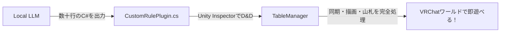

# Local LLM 向けゲームルール生成ガイド (省トークン設計)

本ドキュメントは、**「Local LLM（Qwen2.5-Coder, DeepSeek-Coder等）に最小限のトークン（1回あたり数百トークン）を与え、UdonSharp (U#) のコンパイルエラーなく動作するオリジナルルールスクリプトを出力させる」**ためのプロンプトテンプレートと運用マニュアルです。

---

## 1. なぜこの方式でトークンが最小化できるのか？

通常、UnityやVRChatのワールド全体をLLMに読ませると数万トークンを浪費します。
本キットでは、**山札・手札・座席・同期通信を `TableManager` がすべて肩代わり**しているため、Local LLMには**「ルール判定フック（数十行）」だけ**を書かせれば完全に動作します。



---

## 2. Local LLMへの入力プロンプトテンプレート

以下のプロンプトを、そのままLocal LLM（Ollama, LM Studio, WebUI等）にコピー＆ペーストして使用してください。

```markdown
あなたはVRChat向けのC#スクリプト環境「UdonSharp (U#)」の専門エキスパートプログラマーです。
以下の基底クラス「RulePluginBase」を継承した、オリジナルのカードゲームルールスクリプトを作成してください。

### 【厳格なUdonSharp構文制約】（違反するとUnityでコンパイルエラーになります）
1. using System.Linq; は絶対に使用禁止（LINQ構文、ラムダ式、.Where, .Select 等は不可）。
2. 配列の探索・計算はすべて古典的な for または foreach ループで記述すること。
3. async / await, Task, 多重継承, interface, dynamic は使用不可。
4. クラスの先頭には [UdonBehaviourSyncMode(UdonSyncMode.None)] を付与すること。

### 【基底クラスの仕様】
using UdonSharp;
using UnityEngine;
using BoardGameKit.Plugins;

namespace BoardGameKit.Plugins
{
    public class RulePluginBase : UdonSharpBehaviour
    {
        // プレイヤーがそのカードを出せるか判定（trueで出せる）
        public virtual bool CanPlayCard(int playerId, int cardId, int targetSlot) => true;

        // カードが出された直後の処理
        public virtual void OnCardPlayed(int playerId, int cardId, int targetSlot) {}

        // ターン開始時
        public virtual void OnTurnStart(int activePlayerId) {}

        // 勝利判定（勝者のplayerIdを返す。未決着は -1）
        public virtual int CheckWinCondition() => -1;

        // ゲームリセット時
        public virtual void OnGameReset() {}
    }
}

### 【作成したいゲームのルール】
- ゲーム名: [ここにゲーム名を入力。例: シンプル・ハイカード]
- ルール詳細:
  - カードIDは 0〜51（標準トランプ: スート = cardId / 13, ランク = (cardId % 13) + 1）
  - [ルール1: 例: 場に出ているカードより大きい数字しか出せない]
  - [ルール2: 例: 手札が最初になくなったプレイヤーが勝利]

上記要件を満たす C# スクリプトのみをコードブロックで出力してください。
```

---

## 3. 生成されるコード例（シンプル・ハイカードルール）

Local LLMから実際に出力されるコードのイメージです：

```csharp
using UdonSharp;
using UnityEngine;
using BoardGameKit.Plugins;

namespace MyGame.Rules
{
    [UdonBehaviourSyncMode(UdonSyncMode.None)]
    public class HighCardRulePlugin : RulePluginBase
    {
        private int lastPlayedRank = 0;

        public override bool CanPlayCard(int playerId, int cardId, int targetSlot)
        {
            // トランプのランク（1: A, 2〜10, 11: J, 12: Q, 13: K）
            int rank = (cardId % 13) + 1;
            
            // 場に出ているカード以上の数字でなければ出せないガード
            if (lastPlayedRank > 0 && rank <= lastPlayedRank)
            {
                return false; 
            }
            return true;
        }

        public override void OnCardPlayed(int playerId, int cardId, int targetSlot)
        {
            int rank = (cardId % 13) + 1;
            lastPlayedRank = rank;
        }

        public override void OnGameReset()
        {
            lastPlayedRank = 0;
        }
    }
}
```

---

## 4. Unityへの適用手順（ノーコード導入）

1. Local LLMが出力した `.cs` ファイルを `Assets/Projects/Scripts/Plugins/` に保存する。
2. Unityのシーン内にある `TableManager` の Inspector を開く。
3. `Active Rule Plugin` のスロットに、上記スクリプトをドラッグ＆ドロップする。
4. **これだけで、同期・山札・手札と連動した新ゲームが完成します。**
