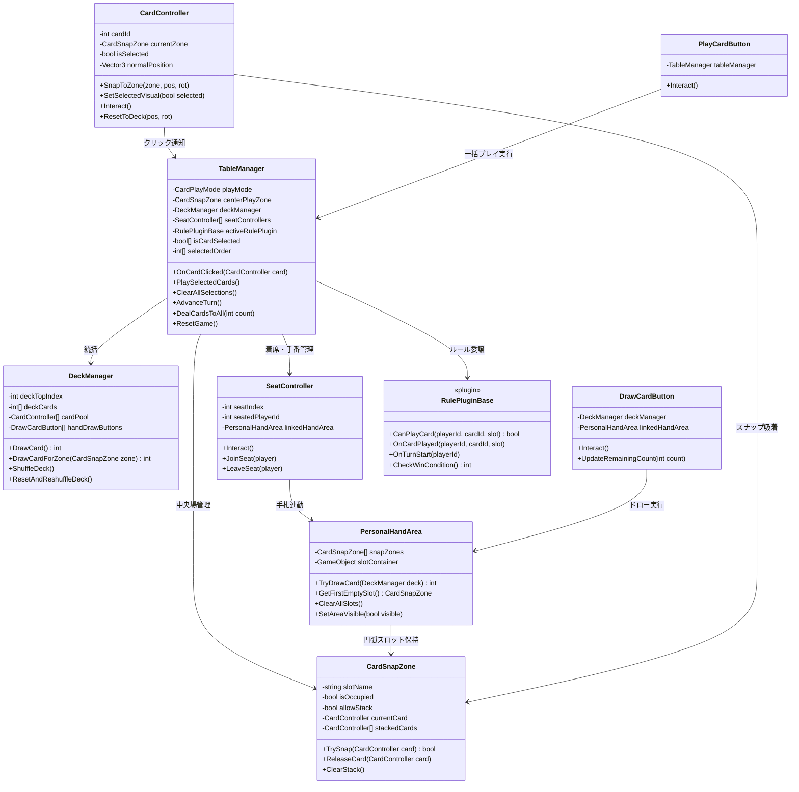

# VRC-BoardGameKit プロジェクト現状共有ドキュメント (for Web版Gemini / LLM)

> **【LLMへの前提プロンプト】**
> あなたはVRChatワールド開発およびUdonSharp (U#) のエキスパートエンジニアです。
> 本ドキュメントには、現在開発中のVRChat向け汎用カードゲーム・ボードゲーム制作パッケージ「**VRC-BoardGameKit**」の設計思想、アーキテクチャ、現在実装されている全主要ソースコード、および今後の拡張課題が集約されています。
> 本ドキュメントの内容を完全に把握した上で、ユーザーからの質問・設計相談・コード生成の指示に対応してください。

---

## 1. プロジェクト概要 ＆ 基本方針

### 1.1 目的
1. **汎用カードゲーム・ボードゲーム制作基盤**:
   - VRChatワールド上で、トランプや自作カードゲームを直感的に配る・引く・プレイできるサンドボックス基盤を提供する。
   - BOOTH配布可能なアセットおよびVPMパッケージ（VCC対応）として設計。
2. **AI親和性設計（省トークン・Local LLM対応）**:
   - 複雑なネットワーク同期・物理挙動・座席・山札管理はコア基盤（`TableManager`等）で完全に吸収する。
   - 大富豪、ポーカー、UNO等のオリジナルルールは、Local LLMやWeb LLMが「数十行のルールプラグイン（`RulePluginBase` 継承）」を出力するだけでノーコード導入できるようにする。

### 1.2 技術スタック ＆ 開発制約
* **Unityバージョン**: Unity 2022.3.x (VRChat SDK Worlds 3.7.x+)
* **スクリプト言語**: UdonSharp (U#) 1.x
* **ネットワーク同期**: Manual Sync (`[UdonBehaviourSyncMode(BehaviourSyncMode.Manual)]`)。変更時のみ `RequestSerialization()` を発行。
* **UdonSharp特有の制約**:
  - `System.Linq` は使用禁止（LINQ構文、ラムダ式等は不可。すべて古典的なfor/foreach）。
  - `interface` や抽象クラスは制限があるため、Unityのコンポーネント指向・Inspector直接バインドおよび仮想メソッドオーバーライドを活用。
  - uGUIのButtonイベントではなく、3D Collider + `Interact()` によるネイティブ操作を原則とする。

### 1.3 設計原則（SOLID / KISS / YAGNI / DRY）
* **優先不等式**: $\mathbf{KISS \;\ge\; YAGNI \;>\; DRY \;>\; SRP/ISP \;>\; OCP}$
* **2層アーキテクチャ**:
  - **コア同期基盤レイヤー**: ネットワーク同期、座席、山札、手札、場、物理配置を一元管理。
  - **ルールプラグインレイヤー**: ゲーム固有の勝敗判定やプレイ可否（バリデーション）のみを疎結合に委譲。
* **Tell, Don't Ask 原則**:
  - 外部からオブジェクトのTransformを直接代入・書き換えせず、コマンド（`SnapToZone`, `SetSelectedVisual`, `ReleaseCard` 等）を発行してオブジェクト自身に姿勢や状態を制御させる。

---

## 2. システムアーキテクチャ ＆ クラス相関図



---

## 3. 現在の動作仕様 ＆ 実装完了ステータス

1. **座席＆参加システム (`SeatController`)**:
   - VRCStationによる強制着席拘束を行わず、座席脇のオブジェクトクリック（Interact）でプレイエリアへの参加・離席をトグル。
   - 他プレイヤーの二重着席を完全防止（排他制御）。
2. **パーソナル手札トレイ (`PersonalHandArea`)**:
   - 着席時のみプレイヤー周囲に大判カード用の円弧状スロット（`CardSnapZone`）が動的出現（非着席時は非表示で視界を塞がない）。
3. **山札＆オブジェクトプール (`DeckManager`)**:
   - 5〜54枚のカード実体を事前プール生成。
   - Fisher-Yatesによる同期シャッフル、山札トップからの順次ドロー、リセット時の全カード山札回収。
   - 山札オブジェクトおよび全席の手元ドローボタンへ、残り山札枚数をリアルタイム同期表示（Zero-Trafficホバーテキスト連動）。
4. **カード操作方式（2つのモード）**:
   - **Immediateモード（即時）**: カードを1クリックすると、即座に中央プレイエリアへ整列スナップ。
   - **MultiSelectモード（複数選択）**: カードをクリックすると手前上方に **15cmスッと浮上**。複数枚を選択後、手元UIの「カードを出す (PLAY)」ボタンを押すと、クリックした順序（FIFO）通りに中央プレイエリアへ一括整列配置。
5. **中央プレイエリア (`centerPlayZone`)**:
   - `allowStack = true` により、出されたカードが手前2mmずつオフセットされて綺麗に重なりスタック（Zファイティング防止）。
   - 場に出たカードは誤操作防止ガード（クリックしても手札に戻らない）。

---

## 4. 全主要ソースコード一覧

### 4.1 `TableManager.cs` (テーブル統括・同期マネージャー)
```csharp
using UdonSharp;
using UnityEngine;
using VRC.SDKBase;
using VRC.Udon;
using VRC.Udon.Common;
using BoardGameKit.Plugins;

namespace BoardGameKit.Core
{
    public enum CardPlayMode
    {
        Immediate,    // 1クリックで即座に場へプレイ（BOOTH配布版）
        MultiSelect   // 複数選択して手元ボタンで場へ（開発・オリジナルルール版）
    }

    [UdonBehaviourSyncMode(BehaviourSyncMode.Manual)]
    public class TableManager : UdonSharpBehaviour
    {
        [Header("Play Settings")]
        [SerializeField] private CardPlayMode playMode = CardPlayMode.Immediate;
        [SerializeField] private CardSnapZone centerPlayZone;

        public CardPlayMode PlayMode => playMode;
        public void SetPlayMode(CardPlayMode mode) => playMode = mode;
        public CardSnapZone CenterPlayZone => centerPlayZone;
        public void SetCenterPlayZone(CardSnapZone zone) => centerPlayZone = zone;

        [Header("Core Subsystem References")]
        [SerializeField] private DeckManager deckManager;
        [SerializeField] private SeatController[] seatControllers;

        [Header("Rule Plugin (Optional)")]
        [SerializeField] private RulePluginBase activeRulePlugin;

        // 複数選択モード管理
        private const int MAX_TRACKED_CARDS = 64;
        private bool[] isCardSelected = new bool[MAX_TRACKED_CARDS];
        private int[] selectedOrder = new int[MAX_TRACKED_CARDS]; // クリック順序（FIFO）
        private int selectedCount = 0;

        // 同期変数
        [UdonSynced] private int currentTurnSeatIndex = 0;
        [UdonSynced] private int gameState = 0; // 0: 待機中, 1: 対戦中, 2: 終局
        [UdonSynced] private int winnerPlayerId = -1;

        public void DealCardsToAll(int cardsPerPlayer)
        {
            if (deckManager == null || seatControllers == null) return;
            if (!TakeOwnership()) return;

            for (int round = 0; round < cardsPerPlayer; round++)
            {
                for (int s = 0; s < seatControllers.Length; s++)
                {
                    SeatController seat = seatControllers[s];
                    if (seat != null && seat.IsOccupied())
                    {
                        DrawCardForPlayer(s);
                    }
                }
            }

            gameState = 1;
            RequestSerialization();
        }

        public void DrawCardForPlayer(int seatIndex)
        {
            if (deckManager == null || seatControllers == null || seatIndex < 0 || seatIndex >= seatControllers.Length) return;
            SeatController seat = seatControllers[seatIndex];
            if (seat == null) return;

            PersonalHandArea handArea = seat.GetLinkedHandArea();
            if (handArea != null)
            {
                handArea.TryDrawCard(deckManager);
            }
        }

        public void AdvanceTurn()
        {
            if (seatControllers == null || seatControllers.Length == 0) return;
            if (!TakeOwnership()) return;

            int startIndex = currentTurnSeatIndex;
            for (int i = 1; i <= seatControllers.Length; i++)
            {
                int nextIndex = (startIndex + i) % seatControllers.Length;
                if (seatControllers[nextIndex] != null && seatControllers[nextIndex].IsOccupied())
                {
                    currentTurnSeatIndex = nextIndex;
                    break;
                }
            }

            RequestSerialization();

            if (activeRulePlugin != null)
            {
                int activePlayerId = seatControllers[currentTurnSeatIndex].GetSeatedPlayerId();
                activeRulePlugin.OnTurnStart(activePlayerId);
            }
        }

        public void ResetGame()
        {
            if (!TakeOwnership()) return;

            if (deckManager != null) deckManager.ResetAndReshuffleDeck();

            if (seatControllers != null)
            {
                for (int i = 0; i < seatControllers.Length; i++)
                {
                    SeatController seat = seatControllers[i];
                    if (seat != null)
                    {
                        PersonalHandArea handArea = seat.GetLinkedHandArea();
                        if (handArea != null) handArea.ClearAllSlots();
                    }
                }
            }

            gameState = 0;
            winnerPlayerId = -1;
            currentTurnSeatIndex = 0;

            if (activeRulePlugin != null) activeRulePlugin.OnGameReset();

            ClearAllSelections();
            RequestSerialization();
        }

        public void OnCardClicked(CardController card)
        {
            if (card == null) return;
            CardSnapZone zone = card.GetCurrentZone();

            // 場のカードはクリック操作不可
            if (centerPlayZone != null && zone == centerPlayZone) return;

            if (playMode == CardPlayMode.Immediate)
            {
                PlayCardImmediate(card);
            }
            else if (playMode == CardPlayMode.MultiSelect)
            {
                ToggleCardSelection(card);
            }
        }

        private bool PlaySingleSelectedCard(CardController card)
        {
            if (card == null || centerPlayZone == null) return false;

            CardSnapZone currentZone = card.GetCurrentZone();
            if (currentZone != null && currentZone == centerPlayZone) return false;

            if (card.CardId >= 0 && card.CardId < isCardSelected.Length)
            {
                isCardSelected[card.CardId] = false;
            }

            VRCPlayerApi localPlayer = Networking.LocalPlayer;
            if (localPlayer != null && !Networking.IsOwner(card.gameObject))
            {
                Networking.SetOwner(localPlayer, card.gameObject);
            }

            bool accepted = centerPlayZone.TrySnap(card);
            if (accepted)
            {
                if (currentZone != null && currentZone != centerPlayZone)
                {
                    currentZone.ReleaseCard(card);
                }
                return true;
            }
            return false;
        }

        private void PlayCardImmediate(CardController card)
        {
            if (card == null || centerPlayZone == null) return;
            PlaySingleSelectedCard(card);
        }

        private void ToggleCardSelection(CardController card)
        {
            if (card == null) return;

            VRCPlayerApi localPlayer = Networking.LocalPlayer;
            if (localPlayer != null && !Networking.IsOwner(card.gameObject))
            {
                Networking.SetOwner(localPlayer, card.gameObject);
            }

            int id = card.CardId;
            if (id < 0 || id >= isCardSelected.Length) return;

            bool nextSelected = !isCardSelected[id];
            isCardSelected[id] = nextSelected;

            if (nextSelected)
            {
                if (selectedCount < selectedOrder.Length)
                {
                    selectedOrder[selectedCount] = id;
                    selectedCount++;
                }
            }
            else
            {
                int foundIndex = -1;
                for (int i = 0; i < selectedCount; i++)
                {
                    if (selectedOrder[i] == id) { foundIndex = i; break; }
                }

                if (foundIndex != -1)
                {
                    for (int i = foundIndex; i < selectedCount - 1; i++)
                    {
                        selectedOrder[i] = selectedOrder[i + 1];
                    }
                    selectedCount--;
                }
            }

            card.SetSelectedVisual(nextSelected);
        }

        public void PlaySelectedCards()
        {
            if (centerPlayZone == null || selectedCount == 0) return;
            if (deckManager == null || deckManager.CardPool == null) return;

            int playedCount = 0;
            for (int i = 0; i < selectedCount; i++)
            {
                int cardId = selectedOrder[i];
                if (cardId < 0 || cardId >= deckManager.CardPool.Length) continue;

                CardController card = deckManager.CardPool[cardId];
                if (card == null) continue;

                if (PlaySingleSelectedCard(card))
                {
                    playedCount++;
                }
            }

            ClearAllSelections();
        }

        public void ClearAllSelections()
        {
            for (int i = 0; i < isCardSelected.Length; i++) isCardSelected[i] = false;
            selectedCount = 0;

            if (deckManager != null && deckManager.CardPool != null)
            {
                for (int i = 0; i < deckManager.CardPool.Length; i++)
                {
                    CardController card = deckManager.CardPool[i];
                    if (card != null && card.IsSelected()) card.SetSelectedVisual(false);
                }
            }
        }

        public bool IsCardSelected(int cardId) => (cardId >= 0 && cardId < isCardSelected.Length) ? isCardSelected[cardId] : false;
        public int GetSelectedCardCount() => selectedCount;

        private bool TakeOwnership()
        {
            if (!Networking.IsOwner(gameObject))
            {
                VRCPlayerApi localPlayer = Networking.LocalPlayer;
                if (localPlayer != null) Networking.SetOwner(localPlayer, gameObject);
            }
            return Networking.IsOwner(gameObject);
        }

        public bool IsPlayerAlreadySeated(int playerId)
        {
            if (playerId == -1 || seatControllers == null) return false;
            for (int i = 0; i < seatControllers.Length; i++)
            {
                if (seatControllers[i] != null && seatControllers[i].GetSeatedPlayerId() == playerId) return true;
            }
            return false;
        }

        public int GetCurrentTurnSeatIndex() => currentTurnSeatIndex;
        public int GetGameState() => gameState;
        public int GetWinnerPlayerId() => winnerPlayerId;
    }
}
```

---

### 4.2 `DeckManager.cs` (山札・プール同期マネージャー)
```csharp
using UdonSharp;
using UnityEngine;
using TMPro;
using VRC.SDKBase;
using VRC.Udon;
using VRC.Udon.Common;

namespace BoardGameKit.Core
{
    [UdonBehaviourSyncMode(BehaviourSyncMode.Manual)]
    public class DeckManager : UdonSharpBehaviour
    {
        [Header("Deck Settings")]
        [SerializeField] private int defaultCardCount = 54;

        [Header("Visual Feedback")]
        [SerializeField] private Transform deckMeshTransform;
        [SerializeField] private DeckInteractHandler interactHandler;
        [SerializeField] private DrawCardButton[] handDrawButtons;

        [Header("Card Object Pool")]
        [SerializeField] private CardController[] cardPool;

        public DeckInteractHandler InteractHandler => interactHandler;
        public void SetInteractHandler(DeckInteractHandler handler) => interactHandler = handler;
        public DrawCardButton[] HandDrawButtons => handDrawButtons;
        public void SetHandDrawButtons(DrawCardButton[] buttons) => handDrawButtons = buttons;
        public CardController[] CardPool => cardPool;
        public void SetCardPool(CardController[] pool) => cardPool = pool;

        [UdonSynced] private int[] deckCards;
        [UdonSynced] private int deckTopIndex = 0;
        [UdonSynced] private int[] discardCards;
        [UdonSynced] private int discardCount = 0;
        [UdonSynced] private bool isInitialized = false;

        private void Start()
        {
            if (Networking.IsOwner(gameObject) && !isInitialized)
            {
                InitializeDeck(defaultCardCount);
            }
        }

        public void InitializeDeck(int totalCards)
        {
            if (!TakeOwnership()) return;

            deckCards = new int[totalCards];
            discardCards = new int[totalCards];
            discardCount = 0;

            for (int i = 0; i < totalCards; i++) deckCards[i] = i;
            deckTopIndex = totalCards;
            ShuffleInternal();

            if (cardPool != null)
            {
                Vector3 deckPos = transform.position;
                Quaternion deckRot = transform.rotation;
                for (int i = 0; i < cardPool.Length; i++)
                {
                    if (cardPool[i] != null)
                    {
                        cardPool[i].SetCardId(i);
                        cardPool[i].ResetToDeck(deckPos, deckRot);
                    }
                }
            }

            isInitialized = true;
            RequestSerialization();
            UpdateVisuals();
        }

        public void ShuffleDeck()
        {
            if (deckTopIndex <= 0 || !TakeOwnership()) return;
            ShuffleInternal();
            RequestSerialization();
        }

        private void ShuffleInternal()
        {
            if (deckCards == null || deckTopIndex <= 1) return;
            for (int i = deckTopIndex - 1; i > 0; i--)
            {
                int randomIndex = Random.Range(0, i + 1);
                int temp = deckCards[i];
                deckCards[i] = deckCards[randomIndex];
                deckCards[randomIndex] = temp;
            }
        }

        public int DrawCard()
        {
            if (deckCards == null || !isInitialized) InitializeDeck(defaultCardCount);
            if (deckTopIndex <= 0 || !TakeOwnership()) return -1;

            deckTopIndex--;
            int drawnCardId = deckCards[deckTopIndex];

            RequestSerialization();
            UpdateVisuals();
            return drawnCardId;
        }

        public int DrawCardForZone(CardSnapZone targetZone)
        {
            if (targetZone == null || targetZone.IsOccupied()) return -1;
            int drawnCardId = DrawCard();
            if (drawnCardId == -1) return -1;

            if (cardPool != null && drawnCardId >= 0 && drawnCardId < cardPool.Length)
            {
                CardController card = cardPool[drawnCardId];
                if (card != null) targetZone.TrySnap(card);
            }
            return drawnCardId;
        }

        public void ResetAndReshuffleDeck()
        {
            if (!TakeOwnership()) return;
            InitializeDeck(defaultCardCount);
        }

        public override void OnDeserialization() => UpdateVisuals();

        private void UpdateVisuals()
        {
            if (deckMeshTransform != null) deckMeshTransform.gameObject.SetActive(deckTopIndex > 0);
            if (interactHandler != null) interactHandler.UpdateInteractionText(deckTopIndex);

            if (handDrawButtons != null)
            {
                for (int i = 0; i < handDrawButtons.Length; i++)
                {
                    if (handDrawButtons[i] != null) handDrawButtons[i].UpdateRemainingCount(deckTopIndex);
                }
            }
        }

        private bool TakeOwnership()
        {
            if (!Networking.IsOwner(gameObject))
            {
                VRCPlayerApi localPlayer = Networking.LocalPlayer;
                if (localPlayer != null) Networking.SetOwner(localPlayer, gameObject);
            }
            return Networking.IsOwner(gameObject);
        }

        public int GetRemainingCount() => deckTopIndex;
        public bool IsDeckEmpty() => deckTopIndex <= 0;
    }
}
```

---

### 4.3 `CardController.cs` (カード自身の中核コントローラー)
```csharp
using UdonSharp;
using UnityEngine;
using VRC.SDKBase;
using VRC.Udon;

namespace BoardGameKit.Core
{
    [UdonBehaviourSyncMode(BehaviourSyncMode.None)]
    public class CardController : UdonSharpBehaviour
    {
        [Header("Card Identity")]
        [SerializeField] private int cardId = 0;

        [Header("System References")]
        [SerializeField] private TableManager tableManager;

        [Header("Selection Visual")]
        [SerializeField] private float selectionElevation = 0.15f;

        private bool isSelected = false;
        private CardSnapZone currentZone = null;
        private Vector3 normalPosition;
        private Quaternion normalRotation;
        private bool hasNormalTransform = false;

        public int CardId => cardId;
        public void SetCardId(int id) => cardId = id;
        public void SetTableManager(TableManager tm) => tableManager = tm;
        public CardSnapZone GetCurrentZone() => currentZone;
        public bool IsSelected() => isSelected;
        public void ClearZone() => this.currentZone = null;

        public void SnapToZone(CardSnapZone zone, Vector3 targetPosition, Quaternion targetRotation)
        {
            this.currentZone = zone;
            this.normalPosition = targetPosition;
            this.normalRotation = targetRotation;
            this.hasNormalTransform = true;
            this.isSelected = false;

            transform.position = targetPosition;
            transform.rotation = targetRotation;
            gameObject.SetActive(true);
        }

        public void SetSelectedVisual(bool selected)
        {
            isSelected = selected;
            if (!hasNormalTransform)
            {
                normalPosition = transform.position;
                normalRotation = transform.rotation;
                hasNormalTransform = true;
            }

            if (isSelected)
            {
                transform.position = normalPosition + (transform.up * selectionElevation);
                transform.rotation = normalRotation;
            }
            else
            {
                transform.position = normalPosition;
                transform.rotation = normalRotation;
            }
        }

        public void ResetToDeck(Vector3 deckPos, Quaternion deckRot)
        {
            isSelected = false;
            hasNormalTransform = false;
            if (currentZone != null)
            {
                currentZone.ReleaseCard(this);
                currentZone = null;
            }
            transform.position = deckPos;
            transform.rotation = deckRot;
            gameObject.SetActive(false);
        }

        public override void Interact()
        {
            if (tableManager != null) tableManager.OnCardClicked(this);
        }
    }
}
```

---

### 4.4 `CardSnapZone.cs` (スナップ吸着枠・スタック制御)
```csharp
using UdonSharp;
using UnityEngine;
using VRC.SDKBase;
using VRC.Udon;

namespace BoardGameKit.Core
{
    [UdonBehaviourSyncMode(BehaviourSyncMode.None)]
    public class CardSnapZone : UdonSharpBehaviour
    {
        [Header("Slot Information")]
        [SerializeField] private string slotName = "SnapSlot_0";

        private bool isOccupied = false;
        private CardController currentCard = null;

        [Header("Stack Settings")]
        [SerializeField] private bool allowStack = false;
        [SerializeField] private float stackElevationOffset = 0.002f;

        private const int MAX_STACK_SIZE = 64;
        private CardController[] stackedCards = new CardController[MAX_STACK_SIZE];
        private int stackedCount = 0;

        public string SlotName => slotName;
        public void SetSlotName(string name) => slotName = name;
        public bool AllowStack => allowStack;
        public void SetAllowStack(bool allow) => allowStack = allow;
        public bool IsOccupied() => isOccupied;
        public CardController GetCurrentCard() => currentCard;
        public int GetStackedCount() => stackedCount;

        public bool TrySnap(CardController card)
        {
            if (card == null) return false;
            if (isOccupied && !allowStack) return false;

            isOccupied = true;
            currentCard = card;

            Vector3 targetPos = transform.position - (transform.forward * stackElevationOffset);
            Quaternion targetRot = transform.rotation;

            if (allowStack)
            {
                targetPos = transform.position - (transform.forward * ((stackedCount + 1) * stackElevationOffset));
                if (stackedCount < MAX_STACK_SIZE)
                {
                    stackedCards[stackedCount] = card;
                    stackedCount++;
                }
            }

            card.SnapToZone(this, targetPos, targetRot);
            return true;
        }

        public void ReleaseCard(CardController card)
        {
            if (card == null) return;

            if (allowStack)
            {
                int foundIndex = -1;
                for (int i = 0; i < stackedCount; i++)
                {
                    if (stackedCards[i] == card) { foundIndex = i; break; }
                }

                if (foundIndex != -1)
                {
                    for (int i = foundIndex; i < stackedCount - 1; i++)
                    {
                        stackedCards[i] = stackedCards[i + 1];
                    }
                    stackedCards[stackedCount - 1] = null;
                    stackedCount--;
                }

                if (stackedCount > 0) currentCard = stackedCards[stackedCount - 1];
                else { isOccupied = false; currentCard = null; }
            }
            else
            {
                isOccupied = false;
                currentCard = null;
            }

            if (card.GetCurrentZone() == this) card.ClearZone();
        }

        public void ClearStack()
        {
            for (int i = 0; i < stackedCount; i++) stackedCards[i] = null;
            stackedCount = 0;
            isOccupied = false;
            currentCard = null;
        }
    }
}
```

---

### 4.5 `PersonalHandArea.cs` (プレイヤー円弧手札エリア)
```csharp
using UdonSharp;
using UnityEngine;
using VRC.SDKBase;
using VRC.Udon;

namespace BoardGameKit.Core
{
    [UdonBehaviourSyncMode(BehaviourSyncMode.None)]
    public class PersonalHandArea : UdonSharpBehaviour
    {
        [Header("Slot References")]
        [SerializeField] private CardSnapZone[] snapZones;
        [SerializeField] private GameObject slotContainer;

        public CardSnapZone[] SnapZones => snapZones;
        public void SetSnapZones(CardSnapZone[] zones) => snapZones = zones;

        private void Start() => SetAreaVisible(false);

        public void SetAreaVisible(bool visible)
        {
            if (slotContainer != null) slotContainer.SetActive(visible);
            else gameObject.SetActive(visible);
        }

        public CardSnapZone GetFirstEmptySlot()
        {
            if (snapZones == null) return null;
            for (int i = 0; i < snapZones.Length; i++)
            {
                if (snapZones[i] != null && !snapZones[i].IsOccupied()) return snapZones[i];
            }
            return null;
        }

        public int TryDrawCard(DeckManager deckManager)
        {
            if (deckManager == null || deckManager.IsDeckEmpty()) return -1;
            CardSnapZone emptySlot = GetFirstEmptySlot();
            if (emptySlot == null) return -1;

            return deckManager.DrawCardForZone(emptySlot);
        }

        public void ClearAllSlots()
        {
            if (snapZones == null) return;
            for (int i = 0; i < snapZones.Length; i++)
            {
                CardSnapZone zone = snapZones[i];
                if (zone != null && zone.IsOccupied())
                {
                    CardController card = zone.GetCurrentCard();
                    if (card != null) zone.ReleaseCard(card);
                }
            }
        }
    }
}
```

---

### 4.6 `SeatController.cs` (座席・着席排他コントローラー)
```csharp
using UdonSharp;
using UnityEngine;
using VRC.SDKBase;
using VRC.Udon;
using VRC.Udon.Common;

namespace BoardGameKit.Core
{
    [UdonBehaviourSyncMode(BehaviourSyncMode.Manual)]
    public class SeatController : UdonSharpBehaviour
    {
        [Header("Seat Identity")]
        [SerializeField] private int seatIndex = 0;
        [SerializeField] private PersonalHandArea linkedHandArea;
        [SerializeField] private TableManager tableManager;

        [UdonSynced] private int seatedPlayerId = -1;
        private int prevSeatedPlayerId = -1;

        public PersonalHandArea GetLinkedHandArea() => linkedHandArea;
        public int GetSeatedPlayerId() => seatedPlayerId;
        public bool IsOccupied() => seatedPlayerId != -1;

        public override void Interact()
        {
            VRCPlayerApi localPlayer = Networking.LocalPlayer;
            if (localPlayer == null) return;

            int myId = localPlayer.playerId;
            if (seatedPlayerId == -1)
            {
                if (tableManager != null && tableManager.IsPlayerAlreadySeated(myId)) return;
                JoinSeat(localPlayer);
            }
            else if (seatedPlayerId == myId)
            {
                LeaveSeat(localPlayer);
            }
        }

        private void JoinSeat(VRCPlayerApi player)
        {
            if (player == null || !player.isLocal || !TakeOwnership()) return;
            seatedPlayerId = player.playerId;
            RequestSerialization();
            ApplySeatStateChange(prevSeatedPlayerId, seatedPlayerId);
            prevSeatedPlayerId = seatedPlayerId;
        }

        private void LeaveSeat(VRCPlayerApi player)
        {
            if (player == null || !player.isLocal || !TakeOwnership()) return;
            int oldId = seatedPlayerId;
            seatedPlayerId = -1;
            RequestSerialization();
            ApplySeatStateChange(oldId, -1);
            prevSeatedPlayerId = -1;
        }

        public override void OnDeserialization()
        {
            if (seatedPlayerId != prevSeatedPlayerId)
            {
                ApplySeatStateChange(prevSeatedPlayerId, seatedPlayerId);
                prevSeatedPlayerId = seatedPlayerId;
            }
        }

        private void ApplySeatStateChange(int oldPlayerId, int newPlayerId)
        {
            VRCPlayerApi localPlayer = Networking.LocalPlayer;
            if (localPlayer != null && linkedHandArea != null)
            {
                linkedHandArea.SetAreaVisible(newPlayerId == localPlayer.playerId);
            }
        }

        private bool TakeOwnership()
        {
            if (!Networking.IsOwner(gameObject))
            {
                VRCPlayerApi localPlayer = Networking.LocalPlayer;
                if (localPlayer != null) Networking.SetOwner(localPlayer, gameObject);
            }
            return Networking.IsOwner(gameObject);
        }
    }
}
```

---

### 4.7 `DrawCardButton.cs` ＆ `PlayCardButton.cs` (手元UIボタン)
```csharp
// DrawCardButton.cs
using TMPro;
using UdonSharp;
using UnityEngine;
using VRC.SDKBase;

namespace BoardGameKit.Core
{
    [UdonBehaviourSyncMode(BehaviourSyncMode.None)]
    public class DrawCardButton : UdonSharpBehaviour
    {
        [SerializeField] private DeckManager deckManager;
        [SerializeField] private PersonalHandArea linkedHandArea;
        [SerializeField] private SeatController linkedSeat;
        [SerializeField] private TextMeshPro buttonText;

        public void UpdateRemainingCount(int remainingCount)
        {
            if (remainingCount > 0)
            {
                this.InteractionText = $"カードを引く (残り: {remainingCount}枚)";
                if (buttonText != null) buttonText.text = $"カードを引く\n<size=70%>(残り: {remainingCount}枚)</size>";
            }
            else
            {
                this.InteractionText = "山札なし (0枚)";
                if (buttonText != null) buttonText.text = "山札切れ\n<size=70%>(0枚)</size>";
            }
        }

        public override void Interact()
        {
            VRCPlayerApi localPlayer = Networking.LocalPlayer;
            if (localPlayer == null || linkedSeat == null || linkedSeat.GetSeatedPlayerId() != localPlayer.playerId) return;
            if (linkedHandArea != null && deckManager != null) linkedHandArea.TryDrawCard(deckManager);
        }
    }
}

// PlayCardButton.cs
using UdonSharp;
using UnityEngine;

namespace BoardGameKit.Core
{
    [UdonBehaviourSyncMode(BehaviourSyncMode.None)]
    public class PlayCardButton : UdonSharpBehaviour
    {
        [SerializeField] private TableManager tableManager;
        public void SetTableManager(TableManager tm) => tableManager = tm;

        private void Start() => this.InteractionText = "カードを出す (Play)";

        public override void Interact()
        {
            if (tableManager != null) tableManager.PlaySelectedCards();
        }
    }
}
```

---

### 4.8 `RulePluginBase.cs` (ゲームルール拡張ベースクラス)
```csharp
using UdonSharp;
using UnityEngine;
using VRC.SDKBase;

namespace BoardGameKit.Plugins
{
    /// <summary>
    /// オリジナルカードゲームのルール拡張用ベースクラス。
    /// TableManagerから各イベントフックが呼び出される。
    /// </summary>
    [UdonBehaviourSyncMode(BehaviourSyncMode.None)]
    public class RulePluginBase : UdonSharpBehaviour
    {
        [Header("Plugin Info")]
        public string ruleName = "Standard Sandbox";

        // プレイヤーがそのカードを出せるか判定
        public virtual bool CanPlayCard(int playerId, int cardId, int targetSlot) => true;

        // カードが出された直後の処理
        public virtual void OnCardPlayed(int playerId, int cardId, int targetSlot) {}

        // ターン開始時
        public virtual void OnTurnStart(int activePlayerId) {}

        // ターン終了時
        public virtual void OnTurnEnd(int activePlayerId) {}

        // 勝利判定（勝者のplayerIdを返す。未決着は -1）
        public virtual int CheckWinCondition() => -1;

        // ゲームリセット時
        public virtual void OnGameReset() {}
    }
}
```

---

## 5. 今後の構想・検討中の課題（汎用カードゲーム基盤化と大富豪）

現在、本パッケージを「**あらゆるカードゲーム（大富豪、ポーカー、UNO、TCG等）を成立させる汎用基盤**」へと昇華させるための設計検討を行っています。

### 検討中の4大コア拡張要素:
1. **ゾーン移動モデルの完成**:
   - 山札・手札・場の3つに加え、「**捨て札置き場（Discard Pile）**」の新設。
   - 「場を流す（`SweepFieldToDiscard`）」「捨て札を山札へ戻す（`RecallDiscardToDeck`）」のAPI化。
2. **手番・進行エンジンの導入**:
   - サンドボックスから「手番排他制御」への移行。
   - 手元UIへの「**パス（PASS）ボタン**」新設と、全員パス検知によるラウンド終了・場流れサイクルの自動化。
3. **可変手札コンテナ＆ソート機能**:
   - 大富豪（13〜14枚）など大量の手札に対応する重なり扇状レイアウト。
   - 手札を数字順・スート順に瞬時に並び替える「**SORTボタン**」。
4. **複数枚バッチ判定フックの追加**:
   - `RulePluginBase` への `CanPlayCards(int playerId, int[] cardIds)` 新設と、`TableManager.PlaySelectedCards` でのバリデーション呼び出し。
